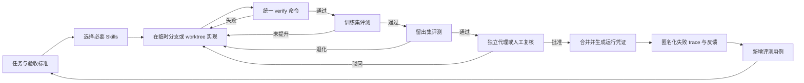

# 迅雷 AI 片库：AI 编码工作流审查报告

> 审查方法：Better-Harness + 项目现有工程规范  
> 审查日期：2026-07-29  
> 审查对象：`E:\xunlei` 中的代理指令、Skills、参考项目、前后端 Demo、测试、文档与交付链路  
> 说明：本报告评估的是 **AI 编码工作流成熟度**，不是产品创意或 Demo 完成度。

## 一、执行摘要

**总体评分：42 / 100（已有工程护栏，但尚未形成可持续改进的 AI 编码 Harness）**

项目已经具备一套质量较高的静态上下文：产品目标清晰，任务到 Skill 的映射明确，
架构决策记录完整，对模拟数据、AI 输出和用户隐私的边界也有真实约束。单元测试和
端到端测试覆盖了 Demo 的核心链路，说明当前成果不是只有界面，没有验证。

主要问题不在产品代码，而在工作流闭环：项目没有根级 Git 仓库、CI、统一验证入口、
训练集/留出集、基线成绩、代理执行轨迹和候选方案晋级规则。当前交付质量依赖同一个
代理记住规范、逐项执行命令并自行复核；换一个代理、换一台机器或过一段时间重做，
结果不一定能稳定复现。

Better-Harness 的核心不是再增加一份提示词，而是把“上下文、执行、评测、反馈、晋级”
变成可运行且有证据的循环。项目下一阶段应优先建设这套循环，而不是继续增加 Skills。

## 二、主要发现

### P1-1：缺少版本控制与自动合并门禁

**证据**

- 项目根目录不是 Git 仓库，没有可审查的提交历史、分支或回滚点。
- 不存在 `.github/workflows/`，测试要求只存在于 `AGENTS.md` 的“实施约束”中。
- 不存在根级 `.gitignore`，大量生成物和参考仓库没有统一排除规则。

**影响**

AI 修改无法稳定回答“改了什么、为何修改、谁复核过、验证结果是什么”。即使当前测试
通过，也没有机制阻止下一次修改绕过测试直接进入提交材料。

**建议**

1. 初始化根级 Git 仓库，首个基线提交只包含自有源码、文档、锁文件和必要样例资源。
2. 增加根级 `.gitignore`，排除 `node_modules/`、`dist/`、`tmp/`、测试报告、交付产物
   和 `references/` 内嵌仓库。
3. 建立 Windows CI，强制执行统一验证命令；主分支只接受验证通过且完成独立复核的变更。
4. 每次 AI 任务保存任务描述、变更摘要、测试结果和人工确认，不以聊天记录代替工程记录。

### P1-2：没有 Better-Harness 所需的评测与晋级闭环

**证据**

- `AGENTS.md` 已要求使用 `llm-evaluation`，但项目中没有 `evals/`、训练集、留出集、
  基线分数、失败样本库或候选方案记分板。
- 当前单元测试覆盖固定样例；`app/src/lib/search.test.ts` 验证已知查询，
  `app/src/data/schema.test.ts` 验证数据契约，但不能衡量代理在新任务上的泛化能力。
- Playwright 只在失败时保留运行 trace（`app/playwright.config.ts:11`），没有把代理决策、
  命令、耗时、失败原因和人工反馈沉淀为可检索数据。

**影响**

工作流无法证明某次提示词、Skill 或工具调整真的提升了成功率，也无法识别“训练用例变好、
未见用例变差”的过拟合。失败经验留在对话中，下一次代理仍可能重复相同错误。

**建议**

1. 建立 `harness/evals/train.yaml` 和 `harness/evals/holdout.yaml`。
2. 对现有流程跑一次不可修改的基线，记录成功数、失败类型、总耗时和人工干预次数。
3. 候选 Harness 只能在临时分支或 worktree 中运行，不直接修改正式基线。
4. 候选方案必须同时提升训练集与留出集综合成绩才可晋级；不能只看单个案例。
5. 把真实失败 trace 经过隐私清理后转成新评测用例，并标记来源与加入日期。

### P1-3：没有统一、可执行的完成定义

**证据**

- `app/package.json:6-14` 提供 `lint`、`test`、`build`、`test:e2e` 等分散命令，
  没有单一 `check` 或 `verify` 入口。
- `app/README.md:23-31` 仍要求人工依次运行五条命令。
- PDF、旁白、录屏、离线包和最终压缩包由不同脚本与临时命令串联，没有根级构建入口，
  也没有机器可读的交付清单。

**影响**

“完成”取决于执行者是否记得所有步骤。代理可能只跑构建而漏掉 E2E、离线包或文档检查，
仍然宣称任务完成。

**建议**

新增两个根级入口：

```powershell
.\tools\verify.ps1
.\tools\build-submission.ps1
```

`verify.ps1` 应依次检查环境、依赖锁、Lint、单元测试、构建、桌面/移动 E2E、隐私关键字、
文档链接和产物完整性。命令结束时生成 `output/run-receipt.json`，记录 Git SHA、Node/npm
版本、命令结果、测试数量、耗时和产物哈希。

### P1-4：上下文卫生不足，容易污染代理检索结果

**证据**

- `references/` 约 29,735 个文件、568.69 MB。
- `app/node_modules/` 约 12,957 个文件、182.24 MB。
- `output/` 与 `tmp/` 合计超过 230 MB，包含视频、PDF、报告和生成文件。
- 不存在根级 `.rgignore`；普通全文搜索会命中 `dist/` 和 Playwright 的压缩报告。
- `references/README.md` 已有优质索引，但 `AGENTS.md` 只要求优先复用参考代码，
  未要求代理先读索引、禁止递归扫描整个目录。

**影响**

代理会把有限上下文浪费在依赖、压缩代码和历史产物上，增加错误引用、重复实现和修改生成
文件的概率。仓库越大，问题会越明显。

**建议**

1. 添加 `.rgignore`，默认排除依赖、构建目录、报告、临时文件、交付物和参考仓库内部 `.git`。
2. 在 `AGENTS.md` 规定：先读 `references/README.md`，按明确路径读取候选文件，禁止无边界
   递归搜索 `references/`。
3. 把“原始参考仓库”和“已批准复用片段”分开；后者保存在体积小、带许可证说明的目录。
4. 测试产物与评委提交产物使用不同目录，避免自动测试覆盖正式截图。

### P2-1：视觉测试只有截图，没有视觉回归断言

**证据**

`app/e2e/visual.spec.ts:13-39` 使用 `page.screenshot()` 生成桌面和移动截图，但没有
`expect(page).toHaveScreenshot()`、基线图或像素差异阈值。

**影响**

页面即使出现错位、文本溢出或控件遮挡，测试仍可通过；截图只便于人工查看，不能充当门禁。

**建议**

- 保留当前“评委截图生成”脚本，但将其与测试分离。
- 新增稳定的视觉回归用例，冻结字体、动画、时间与视口，对首页、搜索结果、问答证据和移动端
  章节面板建立基线。
- 对视频画面继续使用功能断言，避免动态帧造成无意义的像素波动。

### P2-2：运行环境存在未机器化声明的 Windows 假设

**证据**

- `app/playwright.config.ts:17` 使用 `npm.cmd`，`app/playwright.config.ts:26-33`
  要求本机安装 Chrome。
- `tools/build_submission_pdf.py:25-26` 依赖 Windows 微软雅黑字体路径。
- `tools/generate_voiceover.ps1` 依赖 Windows SAPI，并含默认绝对路径。
- `app/README.md:12` 使用 `npm.cmd install`，没有使用锁文件严格安装的 `npm ci`。

**影响**

同一流程在 CI、新电脑或非 `E:` 盘环境可能失败，且错误通常到交付阶段才暴露。

**建议**

增加 `tools/preflight.ps1`，检查 Node、npm、Chrome、Python、字体、SAPI、FFmpeg 和端口；
固定 Node 版本，默认使用 `npm ci`；所有工作目录由脚本位置推导或通过环境变量传入。

### P2-3：前端样式文件过大，降低 AI 修改的局部性

**证据**

`app/src/styles/global.css` 共 1,767 行，设计令牌、布局、多个功能区域和响应式规则集中在
同一文件。

**影响**

代理为修改一个组件需要读取和推理大量无关规则，容易引入跨页面回归；代码审查也难以快速
判断样式影响范围。

**建议**

按 `tokens`、`shell`、`library`、`player`、`search`、`assistant` 和 `responsive` 拆分，
保持入口导入顺序明确。拆分应单独提交，并用视觉回归证明行为未改变。

### P2-4：Skills 已配置，但使用过程不可观察

**证据**

`AGENTS.md` 对任务与 Skill 的映射清晰，`.agents/skills/` 中也存在相应 Skill；
但没有执行记录证明代理读取了哪些 Skill、采用了哪些检查项、哪些建议被有意跳过。

**影响**

Skills 可能逐渐变成“存在但未执行”的文档，无法衡量某个 Skill 对结果的真实贡献。

**建议**

每次运行收集以下最小记录：

```json
{
  "task_id": "XL-0001",
  "skills_loaded": ["frontend-ui-engineering", "verification-before-completion"],
  "commands": [],
  "checks": [],
  "human_review": null
}
```

同时增加 Skill 元数据检查，验证名称、路径、触发说明和项目内链接没有漂移。

### P2-5：缺少独立复核角色

**证据**

项目的 `code-review-and-quality` Skill 建议使用独立模型复核，但当前流程没有强制第二代理、
PR 审查人或评委视角验收门禁。

**影响**

同一个代理实现、解释并验证自己的方案，容易共享同一盲区，尤其是交付文案、能力边界、
隐私和离线启动流程。

**建议**

对以下变更强制独立复核：用户数据处理、RAG/提示词、依赖升级、构建脚本、交付包和超过
一定规模的 UI 修改。复核者只读需求、diff、测试证据和产物，不继承实现者的推理过程。

### P3-1：根级入口文档不足

产品和技术文档较完整，但新代理进入根目录后没有根级 `README.md`、架构地图和统一命令表。
当前入口分散在 `AGENTS.md`、两份方案文档、`references/README.md` 与 `app/README.md`。

建议增加一页根级索引，只保留项目状态、目录职责、标准命令、能力边界和文档链接，避免复制
已有长文。

## 三、Better-Harness 记分卡

| 维度 | 权重 | 得分 | 判断 |
|---|---:|---:|---|
| 上下文与产品约束 | 15 | 12 | `AGENTS.md`、方案和 ADR 清晰，边界可信 |
| 可编辑 Harness 表面 | 10 | 4 | 有 Skills，但缺少统一配置、运行器和晋级规则 |
| 可复现工具链 | 15 | 5 | 锁文件与脚本存在，根级入口和环境固定不足 |
| 自动验证传感器 | 15 | 11 | 单测和 E2E 扎实，视觉回归与交付门禁不足 |
| 训练/留出评测 | 20 | 2 | 尚未建立正式评测集和基线 |
| Trace 与反馈学习 | 10 | 1 | 只保留失败浏览器 trace，无代理运行语义 |
| 变更治理与独立复核 | 10 | 2 | 没有 Git、CI、PR 或第二复核者门禁 |
| 安全、隐私与真实表达 | 5 | 5 | schema、拒答、隐私与模拟能力说明较完整 |
| **合计** | **100** | **42** | **工程规范良好，Harness 闭环缺失** |

## 四、现有优势

以下内容应保留并纳入未来 Harness，而不是推倒重来：

1. `AGENTS.md` 用很短的篇幅固定了产品目标、真相来源和参考代码边界。
2. `AGENTS.md` 明确要求 schema 校验、用户隔离、隐私日志、完整 UI 状态和验证证据。
3. `docs/decisions/ADR-001-评审Demo采用预生成索引.md:10` 清楚区分预生成 Demo 与线上推理。
4. `docs/decisions/ADR-002-回答必须引用视频证据.md:10-11` 要求答案必须带视频、时间和证据，并支持拒答。
5. `app/src/data/schema.test.ts` 与 `app/src/lib/search.test.ts` 对数据契约、检索和有依据问答已有
   可执行检查。
6. `app/e2e/demo.spec.ts:4-58` 覆盖完整核心路径、真实视频跳转、无证据拒答和严重可访问性问题。
7. `references/README.md` 已记录参考仓库版本、用途与许可证边界，是良好的参考代码索引。
8. `THIRD_PARTY_NOTICES.md` 与 Demo 说明没有把模拟能力包装成线上能力。

## 五、目标工作流



关键规则：

- 正式基线不可被外层优化代理直接修改。
- 一次只调整一个主要变量，例如 Skill、提示词、工具说明或验证器。
- 训练集用于迭代，留出集只用于晋级判断。
- 综合成功数没有提升时，不接受“感觉更好”的 Harness 变更。
- 产品代码测试通过不等于 AI 编码工作流通过；两者分别计分。

## 六、首批评测集

建议先建立 12 个可重复任务，8 个训练用例、4 个留出用例。每个用例都使用干净 worktree，
设置最长时间和最多人工干预次数。

| ID | 分组 | 任务 | 自动判定 | 人工判定 |
|---|---|---|---|---|
| T01 | 训练 | 修改章节标题并保持时间跳转 | 单测、E2E、schema 全过 | 文案自然 |
| T02 | 训练 | 新增一条无证据问答样例 | 必须拒答且无伪造引用 | 提示可理解 |
| T03 | 训练 | 增加一个加载失败状态 | 组件测试、E2E、无控制台错误 | 状态符合产品语气 |
| T04 | 训练 | 修改移动端章节面板 | 390px 视口无溢出、视觉基线通过 | 操作顺畅 |
| T05 | 训练 | 新增检索字段并迁移样例数据 | schema、排序和旧数据测试通过 | 字段有产品价值 |
| T06 | 训练 | 修复一个注入风险样例 | 安全测试通过、无 `innerHTML` 绕过 | 修复范围合理 |
| T07 | 训练 | 更新一项依赖 | audit、构建、E2E 通过 | 无无关升级 |
| T08 | 训练 | 修改提交文档中的能力描述 | 链接、术语和 PDF 构建通过 | 不夸大 Demo 能力 |
| H01 | 留出 | 新增跨视频查询 | 返回多视频证据与时间戳 | 排序合理 |
| H02 | 留出 | 处理损坏的章节数据 | schema 拒绝并显示失败状态 | 错误信息清楚 |
| H03 | 留出 | 更换工作区盘符后构建 | 无绝对路径失败、产物哈希齐全 | 操作说明准确 |
| H04 | 留出 | 从空依赖环境完成离线包 | `npm ci` 到离线 E2E 全通过 | 评委可独立启动 |

每个用例建议记录：

- 是否完成核心目标。
- 自动检查通过数。
- 新增回归数量。
- 人工干预次数。
- 总耗时和工具调用数。
- 是否修改了需求之外的文件。
- 是否给出可验证证据。

## 七、实施路线

### 第 0 阶段：一天内建立最低门禁

1. 初始化 Git，增加根级 `.gitignore` 和 `.rgignore`。
2. 新建根级 `README.md`，只做入口索引。
3. 编写 `tools/preflight.ps1` 与 `tools/verify.ps1`。
4. 增加 `npm run verify`，统一调用 Lint、单测、构建和 E2E。
5. 将现有通过状态保存为 `harness/baseline.json`。

### 第 1 阶段：两到三天建立评测闭环

1. 实现上述 8 个训练任务，暂不让优化代理看到 4 个留出任务。
2. 定义统一结果 schema 和 `run-receipt.json`。
3. 在隔离 worktree 运行基线，记录失败类型。
4. 一次只修改一个 Harness 表面，比较训练与留出成绩。
5. 建立候选变更记分板，保留未晋级原因。

### 第 2 阶段：一周内加强质量传感器

1. 将截图生成与视觉回归测试分离。
2. 增加隐私日志、schema 畸形数据、路径可移植性和离线启动测试。
3. 增加独立代理代码审查与人工产品复核。
4. 从真实失败中补充评测集，并保持来源标签。
5. 在 Windows CI 中运行完整验证并归档 trace、截图、测试报告和产物哈希。

## 八、建议的完成定义

任一 AI 编码任务只有同时满足以下条件才可标记完成：

- 需求和非目标已写明。
- 只加载与任务相关的 Skills 和参考文件。
- 改动位于隔离分支或 worktree，diff 无无关文件。
- `tools/verify.ps1` 退出码为 0。
- 对应训练评测通过，且留出集总分不退化。
- 高风险修改经过独立复核。
- 文档与产品实际能力一致。
- 运行凭证包含环境、测试、产物和哈希。
- 新发现的失败已记录为问题或评测候选。

## 九、审查结论

本项目已经有一副不错的“静态护栏”：规范、Skills、ADR、schema 和 E2E 都有实际内容。
下一步最有价值的投入不是继续收集更多高 Star 项目或 Skills，而是把现有规则变成一个
可执行、可评分、可回放、可晋级的工程系统。

优先完成 Git/CI、统一验证入口、训练/留出评测和运行凭证后，项目的 AI 编码工作流可以从
“依赖当前代理认真执行”升级为“换代理、换时间、换环境仍能得到稳定结果”。这也是
Better-Harness 对本项目最直接的价值。

## 十、方法来源

- [Better Harness 官方示例与运行方式](https://github.com/langchain-ai/deepagents/tree/main/examples/better-harness)
- [Better-Harness 方法说明：基线、训练/留出评测、Trace 与爬坡式改进](https://langchain-blog.ghost.io/better-harness-a-recipe-for-harness-hill-climbing-with-evals/)
