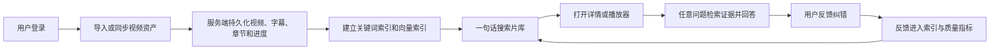
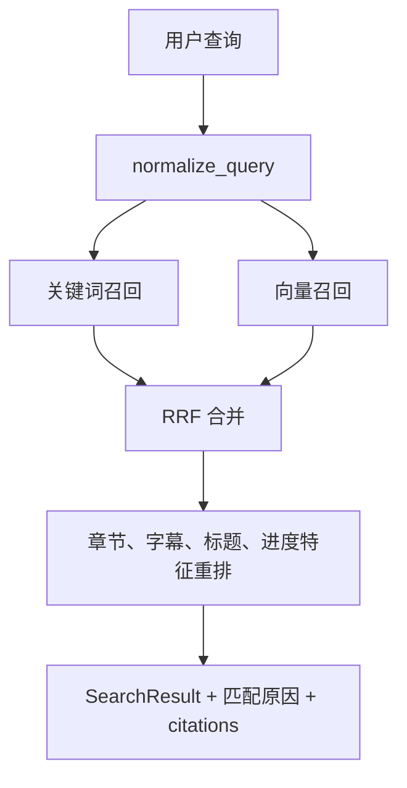
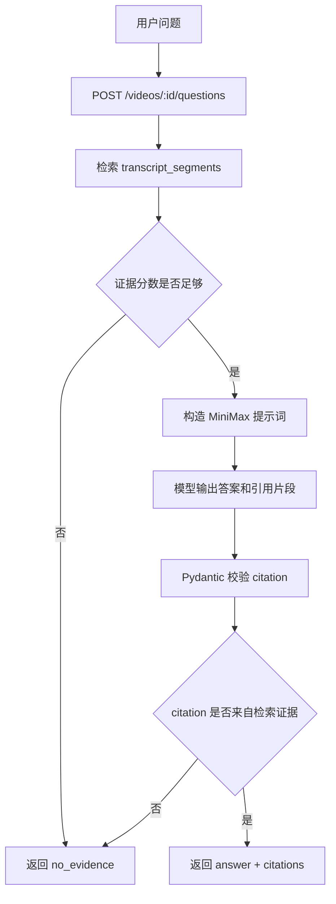

# 迅雷 AI 片库下一阶段产品化实施计划

> 编写日期：2026-08-08  
> 适用范围：在当前 FastAPI + SQLAlchemy + React Demo 基础上，逐步补齐真实片库持久化、后端搜索、任意问视频、反馈闭环、公网部署底座和商业化指标表达。  
> 关联文档：`docs/AI产品创意方案-迅雷AI片库.md`、`docs/项目说明文档.md`

## 1. 总目标

当前 Demo 已经证明“真实视频导入、AI 字幕、摘要、章节、片段跳转”可以跑通，但产品仍偏本地演示。下一阶段目标是把它推进到可持续演示、可公网部署、可解释商业价值的产品原型。

最终要形成的闭环：

## 2. 实施原则

1. 先让数据可靠保存，再扩展 AI 能力。否则搜索、问答、反馈都会建立在易丢失的前端内存上。
2. 所有新增数据库访问必须走 SQLAlchemy ORM 和 Repository，Controller 和 Service 不写散落原生 SQL。
3. 搜索和问答必须保留 citation，不能只给模型回答。
4. 用户上传、字幕、摘要、反馈都属于用户私有数据；公网部署前必须补服务端鉴权、配额和隔离。
5. 每个阶段都要同步更新中文文档、接口说明和 E2E 验收用例。
6. 大功能按分支开发，阶段验收后再合并；小修复可直接提交 main。

## 3. 阶段总览

| 阶段 | 目标 | 主要产物 | 验收重点 |
|---|---|---|---|
| P1 | 真实片库持久化 | videos/assets/subtitles/chapters/user_progress 表与接口 | 刷新后导入视频、字幕、章节、进度仍存在 |
| P2 | 后端混合搜索 | transcript_segments/search_indexes/search API | 搜索不再依赖前端静态规则 |
| P3 | 任意问视频 RAG | question API、证据检索、MiniMax 答案生成 | 任意问题有证据才回答，无证据拒答 |
| P4 | AI 反馈闭环 | feedback 表、纠错入口、反馈状态 | 用户能标记不相关、纠错标题/章节/字幕 |
| P5 | 公网部署底座 | 服务端鉴权、限流、任务取消、Docker/Compose | 可生成公网链接，不被大文件拖垮 |
| P6 | 商业化与指标 | 额度、收益统计、埋点指标 | 能解释会员价值和效率提升 |

## 4. P1 真实片库持久化

### 4.1 目标

解决当前本地导入后刷新丢失的问题。导入视频后，至少要持久保存视频记录、媒体文件位置、字幕文本、章节结构、摘要、标签和观看进度。

### 4.1.1 当前落地进度（2026-08-08）

已完成首轮代码落地：

1. 后端已新增 `videos`、`video_assets`、`subtitles`、`chapters`、`video_tags`、`user_progress`、`transcript_segments` ORM 表。
2. `POST /api/v1/analyses` 上传时会把源视频保存到 `backend/data/media/{video_id}/source.*`，同时创建视频占位记录和 source 资产。
3. 分析完成后会把 AI 字幕、摘要、标签、章节和字幕证据分片写回片库表。
4. 已新增 `GET /api/v1/videos`、`GET /api/v1/videos/{video_id}`、`GET /api/v1/videos/{video_id}/media`、`GET /api/v1/videos/{video_id}/subtitles/active`、`PATCH /api/v1/videos/{video_id}/progress`。
5. 前端已新增 `app/src/api/videos.ts`，登录后会读取服务端片库，并在分析完成后切到服务端详情、媒体和字幕 URL。
6. 播放器已按时间更新观看进度，并通过后端接口写入 `user_progress`。
7. 导入时浏览器抽帧封面已作为 `poster` 资产上传，刷新后仍可通过 `/videos/{video_id}/assets/poster` 展示真实封面。
8. 已新增桌面核心 E2E，覆盖服务端片库刷新后恢复本地导入视频和继续播放入口。
9. 已新增 `DELETE /api/v1/videos/{video_id}`，本地导入视频可删除 ORM 记录、source/poster 文件和空媒体目录。

仍需补齐：

1. 本地登录仍未映射到服务端真实用户，`owner_id/user_id` 先固定为 `demo-local`。
2. 缺少分页、上传配额和定期巡检孤儿文件。

### 4.2 数据库设计

新增实体：

| 表 | 作用 | 关键字段 |
|---|---|---|
| `videos` | 视频主记录 | id、owner_id、title、original_filename、duration_seconds、language、summary、short_description、index_status、created_at、updated_at |
| `video_assets` | 媒体和封面资产 | id、video_id、asset_type、storage_path、mime_type、size_bytes、width、height、checksum |
| `subtitles` | 字幕版本 | id、video_id、origin、language、asr_model、vtt_text、confidence、is_active |
| `chapters` | 智能章节 | id、video_id、title、summary、start_seconds、end_seconds、source、confidence、spoiler_level、sort_order |
| `video_tags` | 标签 | id、video_id、name |
| `user_progress` | 用户观看进度 | id、user_id、video_id、last_position_seconds、completed_percent、updated_at |
| `transcript_segments` | 后续搜索/问答分片 | id、video_id、subtitle_id、start_seconds、end_seconds、text、normalized_text、segment_index |

说明：

- `owner_id/user_id` 先使用 Demo 本地账号映射出的稳定用户 ID；公网阶段再替换为服务端账号。
- 本地开发可继续使用 SQLite；部署阶段切 PostgreSQL。
- 大视频文件不存数据库，先存 `backend/data/media/`，后续可替换对象存储。

### 4.3 后端实施步骤

1. 在 `backend/app/database/models/` 新增上述 ORM 实体。
2. 在 `backend/app/database/repositories/` 新增 `video_repository.py`，先集中处理片库相关查询；后续数据访问复杂后再拆分 asset/subtitle/chapter/progress repository。
3. 在 `backend/app/schemas/` 增加 `VideoCreate`、`VideoDetail`、`VideoListItem`、`ChapterRead`、`SubtitleRead`、`ProgressUpdate` 等 Pydantic schema。
4. 在 `backend/app/services/` 增加 `library_service.py`，负责编排视频导入、分析结果落库、进度更新。
5. 改造 `AnalysisService`：分析完成后不只写 `analysis_jobs.result`，还写入 `videos/subtitles/chapters/tags/transcript_segments`。
6. 增加 API：
   - `GET /api/v1/videos`
   - `GET /api/v1/videos/{video_id}`
   - `GET /api/v1/videos/{video_id}/media`
   - `GET /api/v1/videos/{video_id}/assets/poster`
   - `GET /api/v1/videos/{video_id}/subtitles/active`
   - `PATCH /api/v1/videos/{video_id}/progress`
   - `DELETE /api/v1/videos/{video_id}`
7. 增加数据迁移策略。短期可保留 `create_all()`，但同阶段要补 ADR，说明 Alembic 何时引入。

### 4.4 前端实施步骤

1. 新增 `app/src/api/videos.ts`，封装视频列表、详情、导入、进度接口。
2. 改造 `App.tsx`：启动后从后端加载片库，而不是只初始化 `demoLibrary`。
3. 内置 Demo 视频作为 seed 数据或首次启动导入数据，不再只存在前端静态数组。
4. 改造导入流程：本地文件上传后由后端返回 `video_id/job_id`，前端根据任务状态刷新视频。
5. 播放器定时保存观看进度，关闭/跳转时补一次进度提交。
6. 刷新页面后验证本地导入视频仍出现在片库，章节和字幕仍可打开。

### 4.5 测试与验收

1. 后端 Repository 测试：创建视频、资产、字幕、章节、标签、进度。
2. 后端 Controller 测试：列表、详情、进度更新、删除。
3. E2E：导入视频，等待整理完成，刷新浏览器，视频仍存在且可播放。
4. E2E：播放到某个时间，刷新后“继续播放”从上次位置开始。
5. 文档：更新 `docs/项目说明文档.md` 的数据库设计、接口、流程图。

## 5. P2 自然语言搜索升级

### 5.1 目标

把当前前端规则评分升级为后端搜索服务，支持文件名、标题、标签、摘要、章节、字幕片段的统一检索，并为后续 RAG 提供证据召回能力。

### 5.1.1 当前落地进度（2026-08-08）

已完成第一版服务化检索：

1. 后端已新增 `SearchRequest`、`SearchCitation`、`SearchResultItem`、`SearchResponse` 契约。
2. 已新增 `backend/app/database/repositories/search_repository.py`，通过 SQLAlchemy ORM 读取用户片库、标签、章节和字幕分片。
3. 已新增 `backend/app/services/search.py`，实现文件名检索与可解释混合检索，融合标题/文件名/标签/摘要/章节/字幕片段得分。
4. 已新增 `POST /api/v1/search`，返回匹配原因、置信度和可跳转 citation。
5. 前端 `SearchPage` 已优先调用后端搜索接口；接口不可用或无服务端结果时，保留本地规则作为演示兜底。
6. 已补后端 Repository、Service、Controller 测试，验证字幕和章节证据能被召回。

仍需补齐：

1. 目前是轻量关键词/BM25 思想的确定性融合，还没有接入中文 embedding、pgvector 和向量召回。
2. 尚未记录搜索事件、点击反馈和 Recall@3 样例集。
3. 后端搜索仍使用固定 `owner_id=demo-local`，服务端鉴权完成后要改为真实用户隔离。

### 5.2 技术路线

第一步先实现“关键词 + 轻量语义”：

- SQLite 阶段：使用 `normalized_text`、简单倒排字段、Jaccard/覆盖率/时间片权重做确定性检索。
- PostgreSQL 阶段：引入 pgvector + 中文 embedding。
- 评审阶段如无法部署 embedding 模型，可先保留可解释关键词召回，但接口形态按混合检索设计。

推荐分层：

### 5.3 后端实施步骤

1. 新增 `backend/app/services/search.py`。
2. 新增 `backend/app/database/repositories/search_repository.py`，只负责索引查询。
3. 新增 `SearchRequest`、`SearchResult`、`SearchCitation` schema。
4. 增加 `POST /api/v1/search`。
5. 分片策略：每个字幕片段保留原始时间；长段按 20-40 秒窗口合并，用于召回；结果仍返回真实字幕时间。
6. 重排特征：
   - 标题/文件名精确命中优先。
   - 章节标题命中高于普通字幕命中。
   - 用户观看进度附近命中加权。
   - 已整理视频高于未整理视频。
   - 低置信字幕降低权重。
7. 返回字段必须包含 `matchReason`，说明为什么推荐。

### 5.4 前端实施步骤

1. `SearchPage` 改为调用后端 `/search`。
2. 保留“文件名结果 / AI 推荐”视图；优先使用后端数据，离线时使用本地规则兜底。
3. 搜索结果展示命中的字幕或章节片段，并可直接跳转。
4. 搜索为空时展示“没有找到相关内容”，并提供搜索范围提示。
5. 搜索期间展示“AI 正在理解你的需求”，但不要假装调用大模型；文案可写“正在检索标题、字幕和章节”。

### 5.5 测试与验收

1. 后端搜索单测：标题命中、章节命中、字幕命中、无结果。
2. E2E：搜索“Cookie 登录”能返回 Python 教程和对应时间片段。
3. E2E：搜索不存在内容不返回假结果。
4. 指标：记录 Top3 命中样例集，后续用于 Recall@3。

## 6. P3 任意问题的“问视频”RAG

### 6.1 目标

用户在播放器中输入任意问题，系统从当前视频字幕/章节检索证据，再调用 MiniMax 生成短答案。没有证据时必须拒答。

### 6.1.1 当前落地进度（2026-08-08）

已完成第一版后端 RAG 问答：

1. 已新增 `VideoQuestionRequest`、`VideoQuestionResponse`，复用 `SearchCitation` 作为问答证据结构。
2. 已新增 `backend/app/services/questions.py`，限定在当前视频内检索章节和字幕分片。
3. 已新增 `POST /api/v1/videos/{video_id}/questions`，无证据返回 `no_evidence`，有证据返回答案和 citation。
4. 已在 `backend/app/integrations/minimax.py` 新增 `request_video_answer`，要求 MiniMax 只根据候选证据回答，且 citation id 必须来自候选证据。
5. 前端播放器已优先调用后端问答接口；接口不可用或内置静态样例未入库时，回退到已校验的预生成 QA。
6. 自动化测试已覆盖：问答 Controller、当前视频内证据召回、无证据拒答、模型非法 citation 过滤。

仍需补齐：

1. 问答记录尚未落到 `video_questions` 表，无法沉淀常见问题和质量指标。
2. 证据检索仍是关键词/章节融合，尚未接入 P2 后续的中文 embedding。
3. MiniMax 请求失败时会使用证据摘句兜底，适合 Demo 稳定性；公网版需要把模型失败、无 Key 和无证据分成更明确的状态。

### 6.2 数据流

### 6.3 后端实施步骤

1. 新增 `questions.py`。
2. 新增 `VideoQuestionRequest`、`VideoQuestionResponse` schema，citation 复用 `SearchCitation`。
3. 增加 `POST /api/v1/videos/{video_id}/questions`。
4. 复用 P2 的 search/retrieval 能力，只限定 `video_id`。
5. MiniMax prompt 约束：
   - 只允许根据提供证据回答。
   - citation 必须引用给定片段 ID。
   - 输出 JSON。
   - 无证据返回固定状态。
6. 模型输出后做二次校验：citation ID 必须属于检索候选，时间不能越界。
7. 保存问答记录到 `video_questions` 表，便于反馈和指标统计。

### 6.4 前端实施步骤

1. `PlayerPage` 的问答从本地 `video.qa` 改为调用后端接口。
2. 预生成推荐问题仍可保留，但点击后也走同一个接口。
3. 回答 loading 态要短而明确：检索证据、生成回答。
4. 无证据态保持当前策略，不使用常识补答。
5. citation 点击继续复用播放器 seek。

### 6.5 测试与验收

1. 单测：有证据回答、无证据拒答、模型返回非法 citation 被拒。
2. E2E：问“后面有没有讲保留字”能返回视频内证据。
3. E2E：问“有没有推荐北京餐厅”明确拒答。
4. 质量指标：回答 citation 正确率、无证据误答率。

## 7. P4 AI 结果反馈闭环

### 7.1 目标

让用户能纠正 AI 的错误，并让反馈进入后续索引、排序和质量评估。产品表达重点是“AI 负责初稿，用户轻量审核”。

### 7.1.1 当前落地进度（2026-08-08）

已完成最小反馈入库闭环：

1. 已新增 `ai_feedback` ORM 表，用于保存用户、视频、反馈目标、反馈类型、内容和处理状态。
2. 已新增 `FeedbackCreate`、`FeedbackRead`、`FeedbackSummary` 契约。
3. 已新增 `POST /api/v1/feedback` 和 `GET /api/v1/feedback/summary`。
4. 播放器“问视频”回答的“有帮助 / 不相关”按钮已提交到后端。
5. 搜索结果卡片已支持“不相关”反馈提交。
6. 已补 Repository 和 Controller 测试，验证反馈创建和汇总。

仍需补齐：

1. 反馈目前只保存为 `received`，还没有生成 `correction_tasks` 或进入人工审核流。
2. 搜索排序尚未读取反馈权重，“不相关”不会立即影响下次结果。
3. 章节标题、字幕文字和时间轴纠错入口尚未做成可编辑表单。

### 7.2 数据库设计

新增实体：

| 表 | 作用 | 关键字段 |
|---|---|---|
| `ai_feedback` | 统一反馈 | id、user_id、video_id、target_type、target_id、feedback_type、content、status、created_at |
| `correction_tasks` | 纠错处理任务 | id、feedback_id、status、before_json、after_json、review_note |
| `search_events` | 搜索与点击指标 | id、user_id、query、result_video_id、clicked_at、played_seconds |

反馈类型：

- 搜索结果不相关。
- 问答答案不正确。
- citation 时间不准。
- 章节标题错误。
- 字幕文字错误。
- 视频标题/标签错误。

### 7.3 后端实施步骤

1. 新增 feedback models/repositories/schemas/services。
2. 增加 `POST /api/v1/feedback`。
3. 增加 `GET /api/v1/feedback/summary`，用于前端展示处理概览。
4. 对简单纠错直接写回：
   - 章节标题修改。
   - 视频标题/标签修改。
   - 字幕单句修正。
5. 对复杂反馈先进入 `correction_tasks`，后续可由人工或模型处理。
6. 搜索排序中降低被标记“不相关”的结果权重。

### 7.4 前端实施步骤

1. 搜索结果卡片增加“不相关”按钮。
2. 详情页章节增加“纠正标题/时间”入口。
3. 字幕列表增加“纠正这一句”入口。
4. 问答结果反馈按钮从纯 UI 变为真实提交。
5. 片库首页增加轻量“AI 整理反馈”状态，如“已采纳 3 条纠错”。

### 7.5 测试与验收

1. 单测：反馈创建、状态流转、简单纠错写回。
2. E2E：标记搜索结果不相关后，再次搜索时该结果权重下降。
3. E2E：修改章节标题后，详情页和播放器章节同步变化。
4. 文档：补充反馈闭环流程图。

## 8. P5 公网部署底座

### 8.1 目标

形成可交付公网链接的最小安全底座，避免上传、模型、密钥和任务队列在公网环境失控。

### 8.1.1 当前落地进度（2026-08-08）

已完成可演示部署底座：

1. 仓库根目录已新增 `Dockerfile.backend`，基于 `python:3.12-slim` 启动 FastAPI，并安装 ffmpeg、ASR 和服务依赖。
2. 已新增 `Dockerfile.frontend`，使用 Node 22 构建 React，再由 Nginx 托管静态文件。
3. 已新增 `docker-compose.yml`，组合 backend/frontend，挂载 `xunlei-data` 和 `xunlei-models` 两个 volume。
4. Compose 通过环境变量注入 `MINIMAX_API_KEY`、上传大小、模型路径和缓存路径，不把密钥写入源码。
5. 已新增 `.dockerignore`，排除本地媒体、模型、`.env`、构建产物、依赖目录和参考仓库。
6. 已新增 `deploy/README.md`，说明本地 Compose 启动、数据卷和上线前待办。

仍需补齐：

1. 还没有服务端真实鉴权、用户隔离、上传限流和配额。
2. 任务队列仍是单进程线程池，尚未接 Redis + Celery/RQ/Dramatiq。
3. HTTPS 证书、域名、备份、监控和结构化日志仍需按目标服务器环境配置。

### 8.2 必做项

1. 服务端鉴权：
   - 短期实现 FastAPI session/JWT。
   - 长期接入迅雷账号体系。
   - API 必须基于 user_id 过滤数据。
2. 上传限制：
   - 文件大小限制。
   - 用户每日/每小时分析额度。
   - 只允许白名单 MIME。
   - 临时文件定时清理。
3. 任务队列：
   - 从 `ThreadPoolExecutor(max_workers=1)` 迁移到 Redis + RQ/Celery/Dramatiq。
   - 提供队列位置、取消、超时、重试次数。
4. 部署配置：
   - `Dockerfile.backend`
   - `Dockerfile.frontend`
   - `docker-compose.yml`
   - Nginx HTTPS 反代示例
   - 模型缓存卷
   - 数据库卷
5. 密钥管理：
   - `.env.example` 只保留占位。
   - 生产密钥通过环境变量注入。
   - CI 增加 secret scan。
6. 可观测性：
   - 请求 ID。
   - 结构化日志。
   - 任务耗时、ASR 实时因子、MiniMax 调用耗时。
   - 不记录原始字幕全文和密钥。

### 8.3 验收

1. 未登录 API 返回 401。
2. 用户 A 看不到用户 B 的视频。
3. 超限上传返回 429/413。
4. 任务可取消，取消后不再占用模型队列。
5. Docker Compose 可在空机器拉起前后端。

## 9. P6 商业化与指标表达

### 9.1 目标

让评委看到这不是“炫技 AI 字幕”，而是可以变成迅雷会员权益和高频片库入口的产品能力。

### 9.1.1 当前落地进度（2026-08-08）

已完成轻量产品表达：

1. 片库首页已新增“AI 整理收益”模块，展示已生成字幕时长、可直达章节数、预计少拖动时间和精准整理权益。
2. 指标目前由前端根据 `videos`、章节数量和视频时长即时计算，不依赖额外埋点。
3. “预计少拖动时间”使用保守估算：按已整理视频总时长的 18% 计算，用于训练营 Demo 表达价值，不作为生产计费依据。

仍需补齐：

1. 真实搜索点击、问答 citation 点击和片段播放事件尚未写入事件表。
2. 会员权益、额度、模式权益还没有和服务端配额系统绑定。
3. Top3 命中率、目标内容直达率和成本指标仍需要评测集与埋点支撑。

### 9.2 产品侧表达

新增轻量模块：

1. 片库首页“AI 整理收益”
   - 已整理视频数。
   - 已生成字幕时长。
   - 已生成章节数。
   - 本周通过搜索直达片段次数。
   - 预计节省试播/拖动时间。
2. 任务队列“额度与模式”
   - 快速模式：基础权益。
   - 精准模式：会员/高质量权益。
   - 今日剩余额度。
3. 搜索结果反馈
   - “这个结果帮到我了”
   - “不相关”
   - 用于 Top3 命中率估算。

### 9.3 数据侧指标

新增事件：

| 事件 | 触发 |
|---|---|
| `search_submitted` | 用户提交搜索 |
| `search_result_clicked` | 点击搜索结果 |
| `segment_played` | 从搜索或问答跳转时间片段 |
| `question_submitted` | 用户提问 |
| `answer_citation_clicked` | 点击问答证据 |
| `feedback_created` | 创建反馈 |
| `analysis_completed` | AI 整理完成 |

### 9.4 验收

1. 首页能展示 AI 整理收益。
2. 搜索点击能写入事件表。
3. 问答 citation 点击能写入事件表。
4. 文档中能用真实统计解释“目标内容直达率”。

## 10. 推荐执行顺序

### 第一轮：真实持久化

1. 新增 ORM 表和 Repository。
2. 建立视频列表/详情/进度 API。
3. 改造导入完成后的落库流程。
4. 前端从 API 加载片库。
5. 完成刷新不丢失 E2E。

### 第二轮：搜索服务化

1. 分片字幕入库。
2. 新增后端搜索接口。
3. 前端搜索页切到 API。
4. 增加搜索质量样例集。

### 第三轮：任意问视频

1. 复用搜索分片做当前视频证据检索。
2. MiniMax 生成带 citation 的回答。
3. 前端问答切到 API。
4. 保留无证据拒答 E2E。

### 第四轮：反馈和指标

1. 反馈表和接口。
2. 搜索/问答/章节反馈 UI。
3. 反馈影响排序或写回。
4. AI 整理收益和基础指标卡。

### 第五轮：部署底座

1. 服务端鉴权和用户隔离。
2. 上传限流和配额。
3. 可取消任务队列。
4. Docker Compose 与公网部署说明。

## 11. 每轮完成定义

每一轮都必须满足：

1. 对应代码有中文注释说明关键业务取舍。
2. ORM、Service、Controller、前端 API、页面改动都有测试覆盖。
3. `docs/项目说明文档.md` 同步更新目录、接口、流程图、当前不足。
4. `npm.cmd run lint`、`npm.cmd run test`、`npm.cmd run build`、核心 E2E 通过。
5. 后端相关变更通过 `backend/test.ps1`。
6. 不提交 `.env.local`、数据库、模型、上传文件、构建产物和 API key。

## 12. 风险与取舍

1. **真实视频文件持久化会增加磁盘压力。** 先限制上传大小和数量，后续迁移对象存储。
2. **向量检索部署成本较高。** 先保持接口形态稳定，用关键词召回兜底；有服务器资源后接 pgvector。
3. **任意问视频可能出现模型幻觉。** citation 校验必须在代码里做，不能只靠 prompt。
4. **反馈闭环容易做重。** 首轮只做“不相关”和“章节/字幕纠错”，不做复杂审核后台。
5. **公网部署不等于生产上线。** 训练营提交链接只需稳定演示，但必须避免密钥泄漏和资源滥用。
