# 迅雷 AI 片库项目说明文档

> 文档版本：2.1  
> 编写日期：2026-08-08  
> 适用代码：`E:\xunlei` 当前工作区  
> 项目形态：FastAPI 后端 + React 前端 + SQLite + Nginx 部署配置

## 1. 项目概述

### 1.1 项目定位

“迅雷 AI 片库”面向拥有大量云盘或本地视频的中国大陆用户，解决“文件名记不住、长视频
不知道内容、只能拖动进度条寻找片段”的问题。系统把视频音轨转换为带时间轴的字幕，并在
字幕基础上生成摘要、标签和章节，使用户能够用自然语言找到视频及对应时间片段。

当前仓库是一套可运行、可交互、可测试的产品 Demo。它包含两类能力：

| 类型 | 当前实现 |
|---|---|
| 稳定评审体验 | 3 个中文、1 个英文真实有声视频及预生成 AI 索引；无需等待模型即可搜索、播放、查看字幕和章节 |
| 本地真实分析 | 上传 MP4/WebM，经 FastAPI、音轨校验、ASR、MiniMax-M3、结构校验后生成结果，并写入服务端片库 |

### 1.2 核心目标

1. 自动从无字幕视频的音轨生成 WebVTT 字幕。
2. 为视频生成简体中文摘要、关键词和可跳转章节。
3. 支持文件名搜索和基于字幕、摘要、章节的自然语言检索。
4. 回答当前视频的问题，并给出可核验、可跳转的时间证据。
5. 对没有视频证据的问题明确拒答，不使用模型常识编造答案。
6. 展示本地导入、任务排队、失败、重试和完成状态。

### 1.3 当前能力边界

- **已实现**：默认登录页、本地视频导入、浏览器元数据读取、真实媒体播放、字幕同步、
  预生成内容检索、服务端自然语言搜索接口、本地 AI 分析 API、任务持久化、片库持久化数据模型、
  媒体/字幕读取接口、分析结果落库、前端启动读取服务端片库、封面资产持久化、观看进度保存、
  AI 结果反馈入库、磁链格式校验与本机协议调用。
- **Demo 实现**：注册登录只保存在浏览器本地，不是迅雷账号；未登录时前端会拦截片库、
  播放器、导入和搜索页面；内置问答来自经校验的样例数据；内置视频仍由前端静态数据
  保障评审稳定，本地导入视频已通过服务端持久化。
- **未实现**：真实迅雷云盘文件列表、迅雷账号 OAuth、云端磁链转存、在线多用户权限隔离、
  生产级向量数据库和分布式任务队列。
- **明确禁止的误解**：视频内嵌字幕只可作为离线 ASR 评测标准答案，生产字幕生成不使用 OCR
  或内嵌字幕。

## 2. 技术栈

| 层级 | 技术 | 用途 |
|---|---|---|
| 前端 | React 19、TypeScript 6、Vite 8 | 页面、状态编排、开发与生产构建 |
| 前端校验 | Zod | 校验静态数据和后端响应，阻止不可信数据进入 UI |
| 播放器 | Plyr | 视频播放控件、字幕开关、时间轴 |
| 图标 | Lucide React | 统一界面图标 |
| 后端 | FastAPI、Uvicorn | REST API、OpenAPI、应用生命周期 |
| 数据契约 | Pydantic | 请求参数、响应和模型结果约束 |
| ORM | SQLAlchemy 2.0 | 实体、查询、事务和 SQLite/PostgreSQL 兼容入口 |
| 数据库 | SQLite（默认） | 持久化 AI 分析任务状态和结果 |
| 快速 ASR | FunASR Paraformer-zh | 中文音轨识别、VAD、标点和句/字符级时间戳 |
| 精准 ASR | faster-whisper large-v3 + stable-ts | 大模型转写、词级时间戳和基于音频静音区的时间轴收紧 |
| 内容整理 | MiniMax-M3 | 简体中文摘要、标签、章节和低置信字幕保守校订 |
| 媒体解码 | PyAV | 音轨存在性和媒体可解码性检查 |
| 测试 | Pytest、Vitest、Testing Library、Playwright、axe | 后端、前端、端到端、视觉与可访问性验证 |
| 部署入口 | Nginx | React 静态文件、History 回退、`/api/` 反向代理 |

## 3. 总体架构

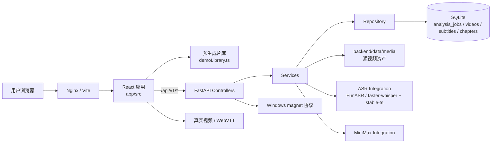
```mermaid
flowchart LR
    U["用户浏览器"] --> N["Nginx / Vite"]
    N --> R["React 应用\napp/src"]
    R --> D["预生成片库\ndemoLibrary.ts"]
    R -->|"/api/v1/*"| C["FastAPI Controllers"]
    C --> S["Services"]
    S --> P["Repository"]
    P --> DB[("SQLite\nanalysis_jobs / videos / subtitles / chapters")]
    S --> FS["backend/data/media\n源视频资产"]
    S --> A["ASR Integration\nFunASR / faster-whisper + stable-ts"]
    S --> M["MiniMax Integration"]
    C --> W["Windows magnet 协议"]
    R --> V["真实视频 / WebVTT"]
```

### 3.1 分层约束

后端依赖方向为 `Controller -> Service -> Repository / Integration`：

- Controller 只定义地址、参数、HTTP 状态码和响应。
- Service 编排上传、模型调用、状态流转和临时文件清理。
- Repository 是 ORM 数据访问入口；Controller 和 Service 中不散落原生 SQL。
- Integration 隔离 ASR、MiniMax 和操作系统协议等外部能力。
- Schema 同时约束 HTTP 数据与模型结果。

前端依赖方向为 `main -> App -> views/features -> components/api/lib/data`：

- `App.tsx` 持有跨页面状态和任务轮询。
- `views/` 负责完整页面。
- `features/` 负责导入、账号、队列等跨页面业务。
- `api/` 只负责请求后端和校验响应。
- `data/` 提供领域结构与预生成样例数据。

## 4. 项目目录总览

```text
E:\xunlei
├── .agents/                 项目级 AI 开发 Skills
├── .github/workflows/       GitHub Actions 验证流程
├── app/                     React 前端、前端测试和演示媒体
├── backend/                 FastAPI、ORM、AI 集成与后端测试
├── deploy/nginx/            生产反向代理配置
├── docs/                    产品、架构、决策和评审文档
├── harness/                 AI 编码工作流的可执行评测资产
├── output/                  本地生成的测试、PDF、截图和提交产物
├── packaging/               Windows 离线启动器和使用说明
├── references/              已筛选的开源参考仓库
├── tmp/                     本地临时工具、录屏和验证目录
├── tools/                   启动、预检、验证和提交脚本
├── Dockerfile.backend       FastAPI 后端容器镜像定义
├── Dockerfile.backend.cloud 腾讯云小规格公网 Demo 的轻量后端镜像定义
├── Dockerfile.frontend      React 构建与 Nginx 静态托管镜像定义
├── docker-compose.yml       前后端、数据卷和模型缓存卷编排
├── .dockerignore            容器构建上下文排除规则
├── .gitignore               Git 忽略规则
├── .nvmrc                   Node 版本约束
└── .rgignore                ripgrep 搜索排除规则
```

`output/`、`tmp/`、`node_modules/`、`.venv/`、`dist/` 和 `__pycache__/` 均为生成物或本机
环境，不属于业务源码。`references/` 内每个参考项目是独立 Git 仓库，不应整体复制进产品。

## 5. 前端目录与文件职责

### 5.1 `app/` 根目录

| 文件/目录 | 具体功能 |
|---|---|
| `index.html` | Vite HTML 入口，提供 React 挂载节点 |
| `package.json` | 前端依赖及 `dev/build/lint/test/test:e2e/verify` 命令 |
| `package-lock.json` | 固定 npm 依赖解析结果 |
| `vite.config.ts` | React 插件、Vitest 环境及开发期 `/api` 到 8000 端口的代理 |
| `playwright.config.ts` | 桌面/移动项目、视觉基线、axe 和预览服务配置 |
| `tsconfig*.json` | 浏览器源码、Node 配置文件和项目引用的 TypeScript 约束 |
| `README.md` | Demo 运行、数据真实性、账号、磁链和 AI 队列边界 |

### 5.2 `app/src/`

| 路径 | 具体功能 |
|---|---|
| `main.tsx` | 前端主入口；把 `App` 挂载到 `#root` 并加载全局 CSS |
| `app/App.tsx` | 应用总编排：路由状态、服务端片库加载、导入、账号、搜索、播放、进度保存、队列与后端轮询 |
| `styles/global.css` | 全站布局、组件状态、桌面和移动断点样式 |
| `assets/hero.png` | 前端构建期静态图片资源 |
| `types/library.ts` | 页面筛选条件、视图模式等 UI 类型 |
| `test/setup.ts` | Vitest DOM 匹配器与测试环境初始化 |

### 5.3 `app/src/views/`

| 文件 | 具体功能 |
|---|---|
| `LibraryPage.tsx` | 片库总览、AI 引导问题、AI 整理收益、筛选、排序、网格/列表和视频卡片 |
| `SearchPage.tsx` | 优先调用后端搜索接口，展示文件名结果/AI 推荐、匹配原因、字幕/章节证据与片段跳转 |
| `VideoDetailPage.tsx` | 展示摘要、标签、来源、媒体信息、章节及播放入口 |
| `PlayerPage.tsx` | Plyr 播放器、WebVTT 解析、字幕同步、字幕轨道语言标识、章节跳转和后端优先的“问视频”侧栏 |

### 5.4 `app/src/components/`

| 文件 | 具体功能 |
|---|---|
| `AppHeader.tsx` | 品牌、全局搜索、导入入口和账号入口 |
| `AppSidebar.tsx` | 片库分类、AI 已整理数量、教程数量和队列入口 |
| `VideoCard.tsx` | 视频缩略图、状态、媒体信息、提示、详情和播放按钮 |
| `VideoThumbnail.tsx` | 真实封面优先，缺失时使用稳定的占位画面 |
| `StatusBadge.tsx` | 将索引状态映射为简体中文状态徽标 |
| `EmptyState.tsx` | 搜索或筛选无结果时的统一空状态 |

### 5.5 `app/src/features/`

| 子目录/文件 | 具体功能 |
|---|---|
| `account/AccountDialog.tsx` | Demo 本地注册、登录、退出；支持默认登录页和账号弹窗两种形态；PBKDF2-SHA256 密码派生 |
| `account/accountSession.ts` | 读取当前浏览器本地会话及统一存储键 |
| `import-video/ImportVideoDialog.tsx` | 本地文件选择/拖入、媒体元数据与封面提取、快速/精准模式选择、磁链输入和系统调用 |
| `analysis-queue/analysisQueue.ts` | 队列领域类型、排队状态和已验证内置 AI 字段复用；保留用户 Blob 媒体与封面地址 |
| `analysis-queue/AnalysisQueuePanel.tsx` | 展示快速/精准档位、任务阶段、进度、失败、重试、移除和服务连接状态 |

### 5.6 `app/src/api/`、`router/`、`lib/`、`data/`

| 文件 | 具体功能 |
|---|---|
| `api/analysis.ts` | 创建/查询分析任务并提交 `analysis_mode`、标题、分辨率、编码等元数据；使用 Zod 校验后端任务与结果 |
| `api/videos.ts` | 读取服务端片库/视频详情、映射媒体与字幕 URL、保存观看进度 |
| `api/search.ts` | 调用 `/api/v1/search`，校验搜索响应，并把 citation 映射为播放器可跳转证据 |
| `api/questions.ts` | 调用 `/videos/{video_id}/questions`，校验问视频结果，并映射为前端 QA 结构 |
| `api/feedback.ts` | 提交搜索结果和问视频结果反馈，阻止未校验响应进入 UI |
| `api/system.ts` | 请求后端唤起本机磁链协议并解析错误 |
| `router/index.ts` | 解析 `/`、`/search`、`/videos/:id`、`/videos/:id/play?t=`，封装 History 导航 |
| `lib/search.ts` | 提供离线兜底搜索、规范化查询、文件名匹配、内容评分、章节命中及基于证据的问答/拒答 |
| `lib/time.ts` | 秒数与播放器时间格式化 |
| `data/schema.ts` | Video、Chapter、Evidence、QA 等 Zod 领域契约和 TypeScript 类型 |
| `data/demoLibrary.ts` | 片库总入口；保留英文基准并组合中文精准预计算素材 |
| `data/chineseDemoLibrary.ts` | 2 段中文真实视频的摘要、章节、问答证据和媒体地址；另 1 段中文样例在 `demoLibrary.ts` 中维护 |
| `*.test.ts` | schema、搜索、时间和路由的前端单元测试 |

### 5.7 `app/public/`、`app/e2e/` 和 `app/scripts/`

| 路径 | 具体功能 |
|---|---|
| `public/demo/*.mp4|*.webm` | 浏览器实际播放的本地演示视频 |
| `public/demo/*.vtt` | 预生成或人工校验的 WebVTT 字幕 |
| `public/demo/*poster*.jpg` | 视频海报和接触表 |
| `e2e/demo.spec.ts` | 搜索、详情、播放、字幕、问答、导入、账号等产品闭环 |
| `e2e/visual-regression.spec.ts` | 桌面与移动视觉回归基线 |
| `e2e/visual.spec.ts` | 独立生成评委验收截图，不覆盖回归基线 |
| `scripts/record-submission.mjs` | 使用 Playwright 自动演示并录制提交视频 |

## 6. 后端目录与文件职责

### 6.1 `backend/` 根目录

| 文件 | 具体功能 |
|---|---|
| `.env.example` | MiniMax、数据库、上传限制和 ASR 预热的配置示例 |
| `.env.local` | 本机私密配置；由 `config.py` 读取且不应提交 |
| `requirements.txt` | 固定 FastAPI、SQLAlchemy、FunASR、faster-whisper 等依赖 |
| `setup.ps1` | 创建 `.venv` 并安装后端依赖 |
| `run.ps1` | 启动 Uvicorn 开发服务 |
| `test.ps1` | 使用后端虚拟环境运行测试 |
| `README.md` | 后端分层规则和启动说明 |

### 6.2 `backend/app/`

| 文件 | 具体功能 |
|---|---|
| `app.py` | FastAPI 工厂和正式入口；生命周期内建表、创建 AnalysisService、LibraryService、SearchService 并在退出时关闭任务服务 |
| `main.py` | 兼容旧启动路径的入口转发 |
| `config.py` | 从环境变量和 `.env.local` 构造缓存的 Settings，不在源码写密钥 |
| `__init__.py` | Python 包标识 |

### 6.3 `backend/app/controllers/`

| 文件 | 具体功能 |
|---|---|
| `router.py` | 创建 `/api/v1` 总路由并组合健康、片库、分析、搜索和系统路由 |
| health_controller.py | GET /health，返回服务、ASR 模型、设备、版本及精准模型就绪状态 |
| `library_controller.py` | `GET /videos`、`GET /videos/{video_id}`、媒体读取、活动字幕读取、`PATCH /videos/{video_id}/progress`、`DELETE /videos/{video_id}` |
| `analysis_controller.py` | `POST /analyses` 上传视频；`GET /analyses/{job_id}` 查询任务 |
| `search_controller.py` | `POST /search`，校验自然语言检索请求并返回排序结果和 citation |
| `question_controller.py` | `POST /videos/{video_id}/questions`，限定当前视频生成带证据回答 |
| `feedback_controller.py` | `POST /feedback` 和 `GET /feedback/summary`，保存并汇总 AI 结果反馈 |
| `system_controller.py` | `POST /system/magnet`，校验后调用操作系统磁链协议 |
| `__init__.py` | 对外导出总路由 |

### 6.4 `backend/app/dependencies/`

| 文件 | 具体功能 |
|---|---|
| `application.py` | 从 FastAPI `Request.app.state` 注入单例 AnalysisService、LibraryService、SearchService、QuestionService 和 FeedbackService；提供 Settings 依赖 |
| `__init__.py` | 汇总依赖注入函数 |

### 6.5 `backend/app/services/`

| 文件 | 具体功能 |
|---|---|
| `analysis_jobs.py` | 上传持久化落盘、创建片库占位记录、任务创建、单线程执行、状态更新、音轨校验、ASR/MiniMax 编排、分析结果回填片库；快速模型默认在独立守护线程预热，不占用用户任务执行器 |
| `library.py` | 片库列表、详情、媒体资产读取、活动字幕读取、观看进度和删除清理业务编排；调用 Repository 而不直接接触 ORM |
| `search.py` | 自然语言搜索业务层；融合标题、文件名、标签、摘要、章节和字幕分片得分，并返回可跳转证据 |
| `questions.py` | 当前视频问答业务层；先检索字幕和章节证据，证据不足拒答，证据充足时调用 MiniMax 或证据摘句兜底 |
| `feedback.py` | AI 反馈业务层；当前保存用户反馈，后续接入排序降权、纠错任务和指标面板 |
| `content_analysis.py` | TranscriptSegment、孤立短段修复、保留 ASR 句界、标点/连接词切分、20 字与 4.5 秒显示上限、去标点 VTT、基础摘要和章节构造 |
| `subtitle_alignment.py` | 内置样例字幕时间锚点匹配、低置信插值、重叠消解和保持分段的 VTT 渲染；不改写 AI 文本 |
| `subtitle_review.py` | 根据词/句置信信号筛选校对片段；中文预计算可在同一次请求中全量校对，最多 64 段 |
| `text_normalization.py` | OpenCC 繁转简和大陆常用术语归一化 |
| `__init__.py` | Service 包标识 |

### 6.6 `backend/app/database/`

| 文件/目录 | 具体功能 |
|---|---|
| `base.py` | SQLAlchemy DeclarativeBase 与创建/更新时间混入字段 |
| `session.py` | Engine、SessionLocal、建表、请求会话和后台线程事务边界 |
| `models/analysis_job.py` | `analysis_jobs` ORM 实体 |
| `models/feedback.py` | `ai_feedback` ORM 实体，保存搜索、问答、章节和字幕反馈 |
| `models/video_library.py` | 视频、资产、字幕、章节、标签、观看进度和字幕分片 ORM 实体 |
| `models/__init__.py` | 导出 ORM 实体 |
| `repositories/analysis_job_repository.py` | 任务创建、查询、更新、重启中断恢复和 schema 映射 |
| `repositories/video_repository.py` | 片库列表、详情、source/poster 资产读取、活动字幕读取、分析结果回填、观看进度 upsert、视频删除和 WebVTT 证据分片 |
| `repositories/search_repository.py` | 使用 SQLAlchemy ORM 读取搜索语料，集中隔离后续倒排/向量召回查询 |
| `repositories/feedback_repository.py` | 创建反馈记录、按用户汇总反馈类型计数 |
| `repositories/__init__.py` | 导出 Repository |
| `__init__.py` | 数据库包标识 |

### 6.7 `backend/app/integrations/`

| 文件 | 具体功能 |
|---|---|
| asr.py | 快速/精准模式路由、精准模型完整性检查、PyAV 波形解码、FunASR 与 faster-whisper/stable-ts 适配、静音抑制、词级时间戳和置信信号归一化 |
| `minimax.py` | 构造结构化提示词、调用 MiniMax、提取 JSON、校验/修正章节和字幕结果 |
| `system_links.py` | 校验 BTIH 磁链并通过 Windows `os.startfile` 调用注册协议 |
| `__init__.py` | Integration 包标识 |

### 6.8 `backend/app/schemas/`

`schemas/__init__.py` 定义全部 Pydantic API 契约：

| Schema | 用途 |
|---|---|
| `ChapterResult` | 章节 ID、标题、起止时间、摘要、来源、置信度 |
| `AnalysisResult` | 语言、摘要、标签、VTT、模型、校订数和章节 |
| `AnalysisJob` | 任务 ID、视频 ID、状态、阶段、进度、详情、结果和错误码 |
| `HealthResponse` | 健康检查响应 |
| `MagnetOpenRequest/Response` | 磁链系统调用请求和响应 |
| `SearchRequest/SearchResponse` | 搜索请求、排序结果、匹配原因和可跳转 citation |
| `VideoQuestionRequest/Response` | 当前视频问题、回答状态、答案、置信度和引用证据 |
| `FeedbackCreate/Read/Summary` | 反馈提交、反馈记录和用户反馈计数 |

字段通过 `Field` 约束长度、范围和格式，并使用 camelCase 别名与前端契约一致。

### 6.9 `backend/tests/` 和 `backend/tools/`

| 路径 | 具体功能 |
|---|---|
| `tests/test_architecture.py` | 检查分层、ORM 和禁止散落 SQL 等架构约束 |
| `tests/test_controllers.py` | API 状态码、请求边界和依赖替换 |
| `tests/test_repository.py` | ORM Repository 创建、更新、恢复和映射 |
| `tests/test_media_validation.py` | 文件类型、大小、空文件、音轨和媒体解码错误 |
| `tests/test_asr.py` | ASR 归一化、回退和时间戳行为 |
| `tests/test_content_analysis.py` | 字幕合并、VTT、摘要和章节 |
| `tests/test_minimax_summary.py` | MiniMax 结构化输出、校订、简体中文和异常 |
| `tests/test_subtitle_review.py` | 低置信字幕筛选策略 |
| `tests/test_subtitle_timing.py` | 真实停顿校准、时间单调、低置信插值和禁止二次合并 |
| `tests/test_system_links.py` | 磁链格式与系统调用错误 |
| `tests/fixtures/*.vtt|*.txt` | 中文 ASR 离线标准答案和术语表 |
| `tools/evaluate_asr.py` | 将纯音频 ASR 结果与内嵌字幕标准答案比较，计算 CER |
| `tools/transcribe_vtt.py` | 离线转写并输出 VTT |
| `tools/precompute_demo.py` | 为内置视频预生成可直接展示的索引 |
| `tools/organize_vtt.py` | 对已有 VTT 执行内容整理 |
| `tools/reflow_vtt.py` | 重排过碎字幕段 |
| `tools/align_vtt_timing.py` | 用独立 SRT/VTT Ground Truth 只校准内置 AI 字幕时间并输出报告 |
| `tools/trim_media.py` | 生成评审用短视频素材 |

## 7. 其他工程目录职责

| 路径 | 具体功能 |
|---|---|
| `deploy/nginx/default.conf` | 静态站点、300 MB 请求上限、安全响应头、API 代理和深链接回退 |
| `deploy/README.md` | Docker Compose 启动方式、数据卷、模型缓存和上线前待办 |
| `Dockerfile.backend` | 构建 FastAPI 后端镜像，运行 Uvicorn，并通过环境变量读取密钥 |
| `Dockerfile.backend.cloud` | 腾讯云小规格公网 Demo 的轻量后端镜像，只保留 API ASR、PyAV 音频抽取、数据库和 AI 整理依赖 |
| `Dockerfile.frontend` | Node 22 构建前端，再复制到 Nginx 镜像托管 |
| `docker-compose.yml` | 编排 backend/frontend、健康检查、8080 端口、数据卷和模型缓存卷 |
| `.dockerignore` | 排除 `.env`、媒体、模型、依赖、构建产物和参考仓库 |
| `docs/decisions/` | ADR-001 至 ADR-004，记录预生成索引、证据问答、Harness 和分层架构决策 |
| `docs/reports/` | Better Harness 工作流审查报告 |
| `docs/*.md` | 创意方案、实施计划、技术复用、字幕记录和评委版 Demo 说明 |
| `harness/config.json` | AI 编码 Harness 版本、必需 Skills 与晋级规则 |
| `harness/baseline.json` | 已接受工作流基线 |
| `harness/evals/` | 训练集和留出集任务 |
| `harness/schemas/` | 统一运行凭证 JSON Schema |
| `harness/scorecard.json` | Harness 候选比较记录 |
| `.agents/skills/` | FastAPI、UI、搜索、RAG、测试、安全、文档、代码审查等项目级规范 |
| `.github/workflows/verify.yml` | CI 中运行统一质量门禁 |
| `references/direct/` | 可考虑直接依赖或局部复用的开源项目 |
| `references/architecture/` | 只用于架构参考、禁止直接复制 GPL/AGPL 或品牌资产的项目 |
| `packaging/DemoLauncher.cs` | Windows 离线包启动器 |
| `packaging/使用说明.txt` | 评委本地运行和推荐演示路径 |
| `packaging/提交说明.txt` | 提交物说明 |
| `tools/start-local-demo.ps1` | 自动准备后端并同时启动 8000/5173 服务 |
| `tools/preflight.ps1` | 检查 Node、Python、媒体和提交环境 |
| `tools/verify.ps1` | 统一执行后端、前端、审计和 E2E，并写运行凭证 |
| `tools/check_harness.ps1` | 校验 Harness 结构和内容 |
| `tools/evaluate-harness-candidate.ps1` | 比较候选工作流与基线 |
| `tools/build-submission.ps1` | 生成并校验提交包 |
| `tools/build_submission_pdf.py` | 构建 PDF 文档 |
| `tools/generate_voiceover.ps1` | 生成演示旁白 |

## 8. 数据库设计

所有业务查询由 SQLAlchemy ORM 和 Repository 完成。2026-08-08 产品化迭代已把本地导入
视频从前端内存推进到服务端持久化：源视频保存到 `backend/data/media/`，结构化结果写入
`videos/subtitles/chapters/video_tags/transcript_segments/user_progress` 等表。内置演示视频
仍保留前端静态数据，确保评审时无需等待模型即可展示稳定效果。

### 8.1 `analysis_jobs`

| 字段 | 类型 | 约束/作用 |
|---|---|---|
| `id` | `String(32)` | 主键，UUID 十六进制字符串 |
| `video_id` | `String(100)` | 前端视频 ID，建立索引 |
| `status` | `String(20)` | queued/processing/completed/failed，建立索引 |
| `stage` | `String(80)` | 当前用户可读阶段 |
| `progress` | `Integer` | 0-100 进度 |
| `detail` | `Text` | 当前状态说明或错误提示 |
| `result` | `JSON` | 通过 Pydantic 校验的字幕、摘要、标签和章节 |
| `error_code` | `String(40)` | 稳定错误码，如 `NO_AUDIO_TRACK` |
| `created_at` | `DateTime` | ORM 自动写入创建时间 |
| `updated_at` | `DateTime` | ORM 自动维护更新时间 |

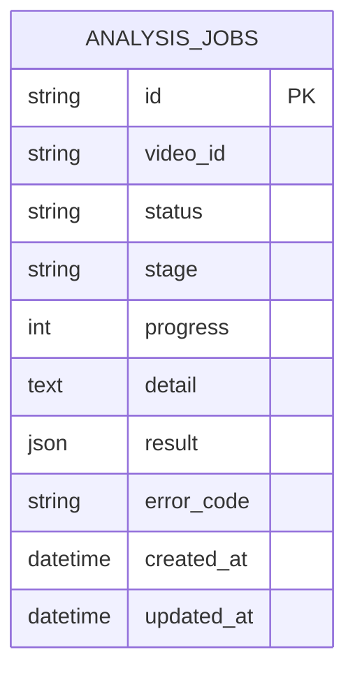
```mermaid
erDiagram
    ANALYSIS_JOBS {
        string id PK
        string video_id
        string status
        string stage
        int progress
        text detail
        json result
        string error_code
        datetime created_at
        datetime updated_at
    }
```

### 8.2 片库持久化表

| 表 | 作用 |
|---|---|
| `videos` | 视频主记录，保存标题、原文件名、时长、语言、摘要、索引状态和归属用户 |
| `video_assets` | 媒体、封面、后续转码产物的存储路径和媒体信息 |
| `subtitles` | AI 字幕、用户修订字幕或外挂字幕版本 |
| `chapters` | 可跳转智能章节，包含标题、摘要、起止时间和置信度 |
| `video_tags` | 视频标签，后续用于搜索和用户纠错 |
| `user_progress` | 按用户保存观看进度和完成比例 |
| `transcript_segments` | 从 WebVTT 解析出的字幕证据分片，供搜索和问视频 RAG 复用 |
| `ai_feedback` | 保存搜索结果、问视频、章节和字幕的用户反馈，后续用于纠错任务和排序 |

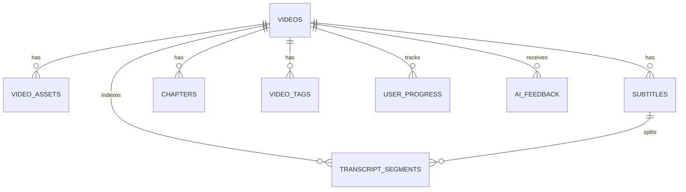
```mermaid
erDiagram
    VIDEOS ||--o{ VIDEO_ASSETS : has
    VIDEOS ||--o{ SUBTITLES : has
    VIDEOS ||--o{ CHAPTERS : has
    VIDEOS ||--o{ VIDEO_TAGS : has
    VIDEOS ||--o{ USER_PROGRESS : tracks
    VIDEOS ||--o{ TRANSCRIPT_SEGMENTS : indexes
    VIDEOS ||--o{ AI_FEEDBACK : receives
    SUBTITLES ||--o{ TRANSCRIPT_SEGMENTS : splits
```

## 9. HTTP 接口

统一前缀为 `/api/v1`，OpenAPI 页面为 `/api/docs`。

| 方法 | 地址 | 请求 | 成功响应 | 代码出处 |
|---|---|---|---|---|
| GET | /api/v1/health | 无 | 服务、模型、设备、版本、精准模型就绪状态 | health_controller.py |
| GET | `/api/v1/videos` | owner_id，可选 | VideoListItem[] | `library_controller.py` |
| GET | `/api/v1/videos/{video_id}` | owner_id，可选 | VideoDetail / 404 | `library_controller.py` |
| GET | `/api/v1/videos/{video_id}/media` | owner_id，可选 | 原视频文件流 / 404 | `library_controller.py` |
| GET | `/api/v1/videos/{video_id}/assets/poster` | owner_id，可选 | 视频封面图片 / 404 | `library_controller.py` |
| GET | `/api/v1/videos/{video_id}/subtitles/active` | owner_id，可选 | WebVTT / 404 | `library_controller.py` |
| PATCH | `/api/v1/videos/{video_id}/progress` | userId、positionSeconds、durationSeconds | ProgressUpdateResponse / 404 | `library_controller.py` |
| DELETE | `/api/v1/videos/{video_id}` | owner_id，可选 | VideoDeleteResponse / 404 | `library_controller.py` |
| POST | `/api/v1/videos/{video_id}/questions` | question、ownerId、limit | VideoQuestionResponse / 404 | `question_controller.py` |
| POST | `/api/v1/search` | query、mode、ownerId、limit | SearchResponse | `search_controller.py` |
| POST | `/api/v1/feedback` | userId、videoId、targetType、targetId、feedbackType、content | FeedbackRead | `feedback_controller.py` |
| GET | `/api/v1/feedback/summary` | user_id，可选 | FeedbackSummary | `feedback_controller.py` |
| POST | `/api/v1/analyses` | multipart：video、video_id、duration_seconds、analysis_mode、title、resolution、codec、width、height | 202 + AnalysisJob | `analysis_controller.py` |
| GET | `/api/v1/analyses/{job_id}` | 路径参数 | AnalysisJob / 404 | `analysis_controller.py` |
| POST | `/api/v1/system/magnet` | JSON：magnet | opened / 422 | `system_controller.py` |

上传边界：只接收 `video/mp4` 和 `video/webm`，默认最大 300 MB，`video_id` 只允许
字母、数字、点、下划线和连字符，时长必须在 0 到 86400 秒之间。

## 10. 功能模块流程与代码出处

以下每个流程节点都对应当前仓库中的真实文件、组件、函数或数据结构。

### 10.1 应用启动

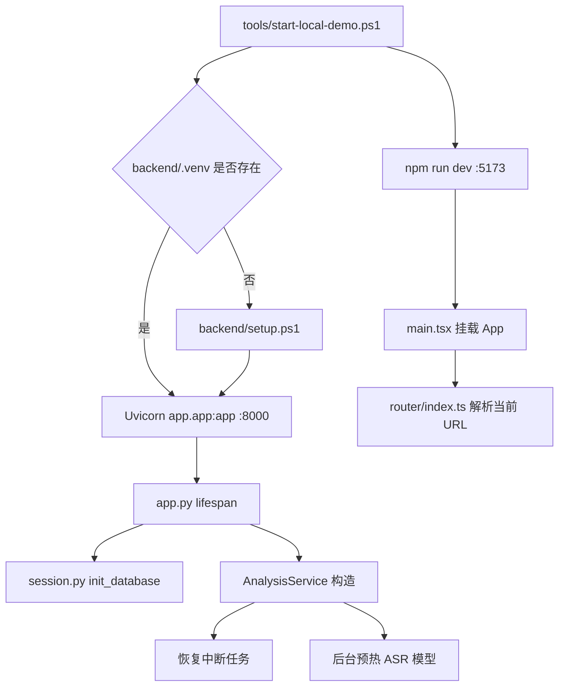
```mermaid
flowchart TD
    A["tools/start-local-demo.ps1"] --> B{"backend/.venv 是否存在"}
    B -->|否| C["backend/setup.ps1"]
    B -->|是| D["Uvicorn app.app:app :8000"]
    C --> D
    D --> E["app.py lifespan"]
    E --> F["session.py init_database"]
    E --> G["AnalysisService 构造"]
    G --> H["恢复中断任务"]
    G --> I["后台预热 ASR 模型"]
    A --> J["npm run dev :5173"]
    J --> K["main.tsx 挂载 App"]
    K --> L["router/index.ts 解析当前 URL"]
```

代码出处：`tools/start-local-demo.ps1`、`backend/app/app.py`、
`backend/app/database/session.py`、`backend/app/services/analysis_jobs.py`、
`app/src/main.tsx`、`app/src/app/App.tsx`、`app/src/router/index.ts`。

### 10.2 片库浏览、筛选与排序

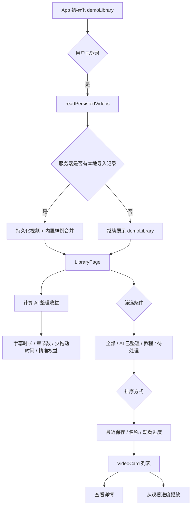
```mermaid
flowchart TD
    A["App 初始化 demoLibrary"] --> B{"用户已登录"}
    B -->|是| C["readPersistedVideos"]
    C --> D{"服务端是否有本地导入记录"}
    D -->|是| E["持久化视频 + 内置样例合并"]
    D -->|否| F["继续展示 demoLibrary"]
    E --> G["LibraryPage"]
    F --> G
    G --> O["计算 AI 整理收益"]
    O --> P["字幕时长 / 章节数 / 少拖动时间 / 精准权益"]
    G --> H{"筛选条件"}
    H --> I["全部 / AI 已整理 / 教程 / 待处理"]
    I --> J{"排序方式"}
    J --> K["最近保存 / 名称 / 观看进度"]
    K --> L["VideoCard 列表"]
    L --> M["查看详情"]
    L --> N["从观看进度播放"]
```

代码出处：`app/src/data/demoLibrary.ts`、`app/src/app/App.tsx`、
`app/src/api/videos.ts`、`app/src/views/LibraryPage.tsx`、`app/src/components/VideoCard.tsx`。

### 10.3 文件名搜索与自然语言内容搜索

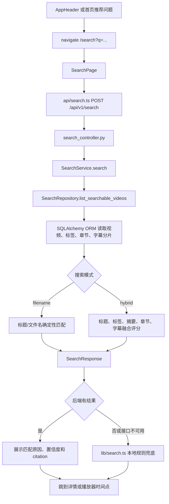
```mermaid
flowchart TD
    A["AppHeader 或首页推荐问题"] --> B["navigate /search?q=..."]
    B --> C["SearchPage"]
    C --> D["api/search.ts POST /api/v1/search"]
    D --> E["search_controller.py"]
    E --> F["SearchService.search"]
    F --> G["SearchRepository.list_searchable_videos"]
    G --> H["SQLAlchemy ORM 读取视频、标签、章节、字幕分片"]
    H --> I{"搜索模式"}
    I -->|"filename"| J["标题/文件名确定性匹配"]
    I -->|"hybrid"| K["标题、标签、摘要、章节、字幕融合评分"]
    J --> L["SearchResponse"]
    K --> L
    L --> M{"后端有结果"}
    M -->|是| N["展示匹配原因、置信度和 citation"]
    M -->|否或接口不可用| O["lib/search.ts 本地规则兜底"]
    N --> P["跳到详情或播放器时间点"]
    O --> P
```

代码出处：`app/src/components/AppHeader.tsx`、`app/src/views/SearchPage.tsx`、
`app/src/api/search.ts`、`app/src/lib/search.ts`、`app/src/router/index.ts`、
`backend/app/controllers/search_controller.py`、`backend/app/services/search.py`、
`backend/app/database/repositories/search_repository.py`。

说明：当前“AI 推荐”优先使用后端服务化检索，融合标题、文件名、标签、摘要、章节和字幕
分片；仍未接入中文 embedding、pgvector 或在线大模型搜索。本地规则只作为后端不可用时的
演示兜底。

### 10.4 视频详情与章节跳转

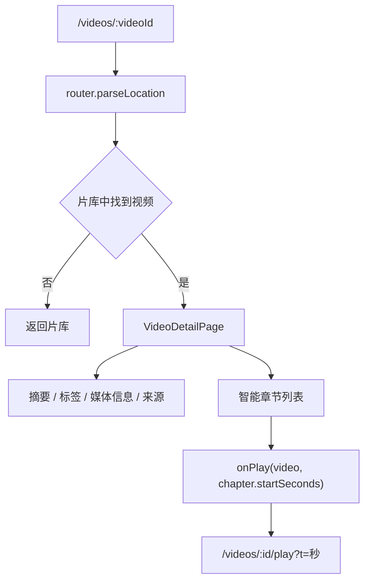
```mermaid
flowchart TD
    A["/videos/:videoId"] --> B["router.parseLocation"]
    B --> C{"片库中找到视频"}
    C -->|否| D["返回片库"]
    C -->|是| E["VideoDetailPage"]
    E --> F["摘要 / 标签 / 媒体信息 / 来源"]
    E --> G["智能章节列表"]
    G --> H["onPlay(video, chapter.startSeconds)"]
    H --> I["/videos/:id/play?t=秒"]
```

代码出处：`app/src/router/index.ts`、`app/src/app/App.tsx`、
`app/src/views/VideoDetailPage.tsx`、`app/src/data/demoLibrary.ts`。

### 10.5 播放器、字幕与时间同步

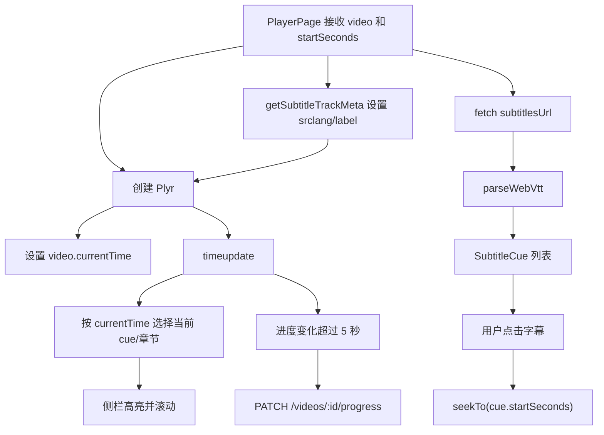
```mermaid
flowchart TD
    A["PlayerPage 接收 video 和 startSeconds"] --> B["创建 Plyr"]
    B --> C["设置 video.currentTime"]
    A --> D["fetch subtitlesUrl"]
    A --> L["getSubtitleTrackMeta 设置 srclang/label"]
    L --> B
    D --> E["parseWebVtt"]
    E --> F["SubtitleCue 列表"]
    B --> G["timeupdate"]
    G --> H["按 currentTime 选择当前 cue/章节"]
    H --> I["侧栏高亮并滚动"]
    F --> J["用户点击字幕"]
    J --> K["seekTo(cue.startSeconds)"]
    G --> M["进度变化超过 5 秒"]
    M --> N["PATCH /videos/:id/progress"]
```

代码出处：`app/src/views/PlayerPage.tsx`、`app/src/lib/time.ts`、
`app/public/demo/*.vtt`、`app/public/demo/*.mp4|*.webm`。

说明：内置中文演示视频打开即展示预计算后的精准字幕结果。字幕后台按“小红书烤肉/对轴”
经验处理为“先出词轴、再按真实停顿和标点对轴、最后校订文本”，不再单独提供增加用户负担
的“精修”标签页；播放器只保留“章节 / 字幕 / 问视频”三个可直接使用的入口。继续播放
初始化阶段会忽略 0-1 秒瞬时事件，避免把已有观看进度错误覆盖为开头。

### 10.6 “问视频”与证据约束

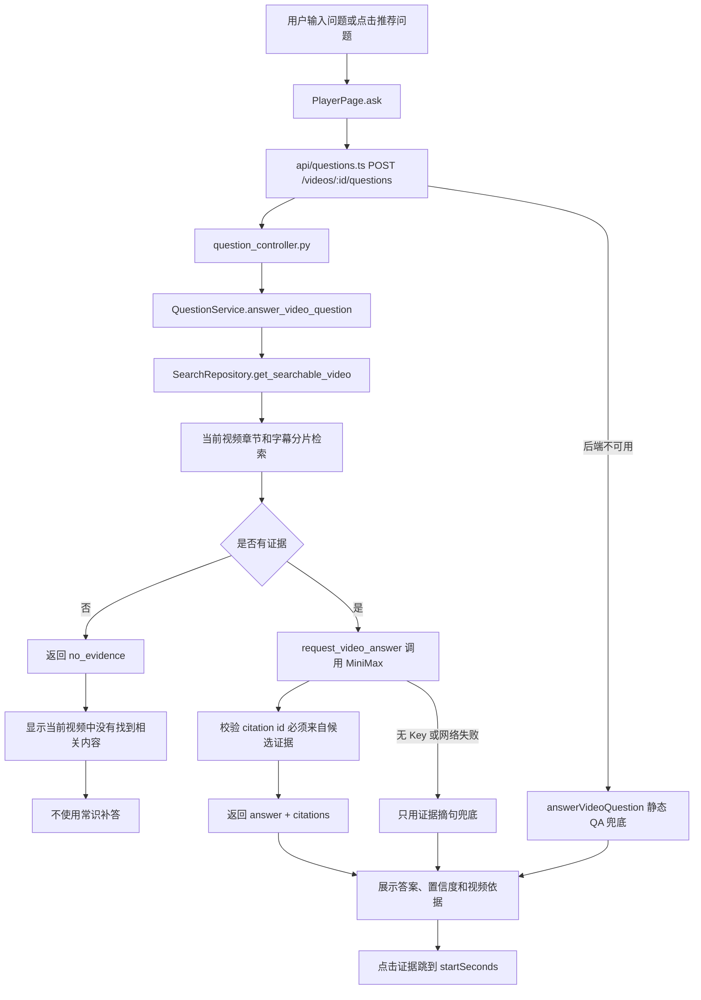
```mermaid
flowchart TD
    A["用户输入问题或点击推荐问题"] --> B["PlayerPage.ask"]
    B --> C["api/questions.ts POST /videos/:id/questions"]
    C --> D["question_controller.py"]
    D --> E["QuestionService.answer_video_question"]
    E --> F["SearchRepository.get_searchable_video"]
    F --> G["当前视频章节和字幕分片检索"]
    G --> H{"是否有证据"}
    H -->|否| I["返回 no_evidence"]
    H -->|是| J["request_video_answer 调用 MiniMax"]
    J --> K["校验 citation id 必须来自候选证据"]
    K --> L["返回 answer + citations"]
    J -->|无 Key 或网络失败| M["只用证据摘句兜底"]
    C -->|后端不可用| N["answerVideoQuestion 静态 QA 兜底"]
    L --> O["展示答案、置信度和视频依据"]
    M --> O
    N --> O
    I --> P["显示当前视频中没有找到相关内容"]
    P --> Q["不使用常识补答"]
    O --> R["点击证据跳到 startSeconds"]
```

代码出处：`app/src/views/PlayerPage.tsx`、`app/src/api/questions.ts`、
`app/src/lib/search.ts`、`backend/app/controllers/question_controller.py`、
`backend/app/services/questions.py`、`backend/app/integrations/minimax.py`、
`backend/app/database/repositories/search_repository.py`、`app/src/data/schema.ts`。

说明：本地导入并完成分析的视频优先走后端 RAG 问答；内置静态样例或后端不可用时，使用
预生成且带证据的 QA 数据保障评审稳定。无论哪条链路，没有视频证据都不会使用常识补答。

### 10.6.1 AI 结果反馈入库

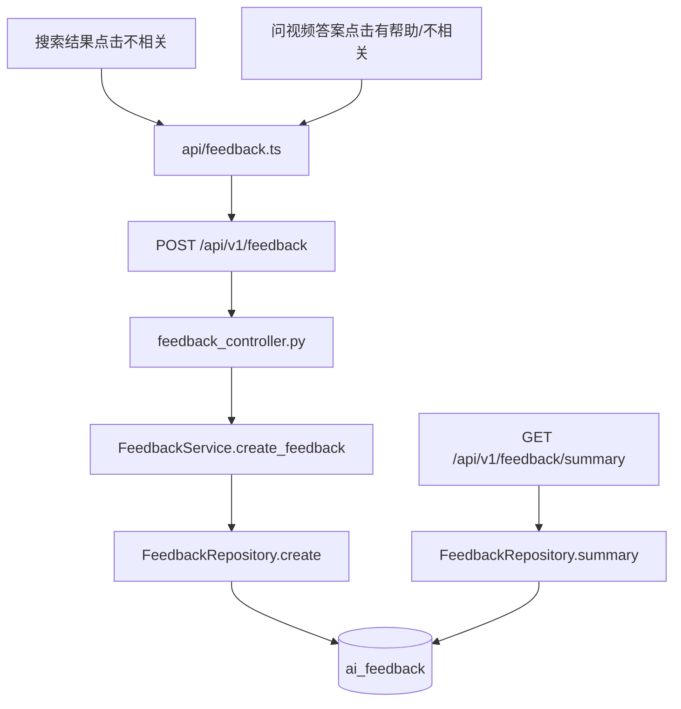
```mermaid
flowchart TD
    A["搜索结果点击不相关"] --> C["api/feedback.ts"]
    B["问视频答案点击有帮助/不相关"] --> C
    C --> D["POST /api/v1/feedback"]
    D --> E["feedback_controller.py"]
    E --> F["FeedbackService.create_feedback"]
    F --> G["FeedbackRepository.create"]
    G --> H[("ai_feedback")]
    I["GET /api/v1/feedback/summary"] --> J["FeedbackRepository.summary"]
    J --> H
```

代码出处：`app/src/api/feedback.ts`、`app/src/views/SearchPage.tsx`、
`app/src/views/PlayerPage.tsx`、`backend/app/controllers/feedback_controller.py`、
`backend/app/services/feedback.py`、`backend/app/database/repositories/feedback_repository.py`、
`backend/app/database/models/feedback.py`。

说明：当前反馈已经真实写入数据库，状态为 `received`。下一步才会让“不相关”影响搜索排序、
让字幕/章节纠错进入 `correction_tasks`，以及在首页展示反馈处理指标。

### 10.7 本地视频导入

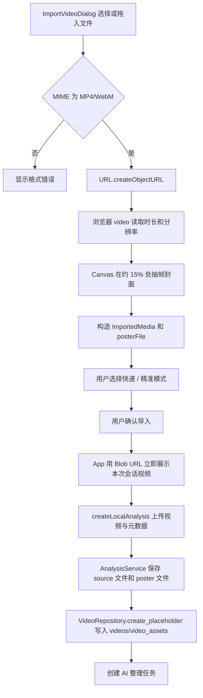
```mermaid
flowchart TD
    A["ImportVideoDialog 选择或拖入文件"] --> B{"MIME 为 MP4/WebM"}
    B -->|否| C["显示格式错误"]
    B -->|是| D["URL.createObjectURL"]
    D --> E["浏览器 video 读取时长和分辨率"]
    E --> F["Canvas 在约 15% 处抽帧封面"]
    F --> G["构造 ImportedMedia 和 posterFile"]
    G --> H["用户选择快速 / 精准模式"]
    H --> I["用户确认导入"]
    I --> J["App 用 Blob URL 立即展示本次会话视频"]
    J --> K["createLocalAnalysis 上传视频与元数据"]
    K --> L["AnalysisService 保存 source 文件和 poster 文件"]
    L --> M["VideoRepository.create_placeholder 写入 videos/video_assets"]
    M --> N["创建 AI 整理任务"]
```

代码出处：`app/src/features/import-video/ImportVideoDialog.tsx`、
`app/src/app/App.tsx`、`app/src/api/analysis.ts`、
`backend/app/services/analysis_jobs.py`、`backend/app/database/repositories/video_repository.py`、
`app/src/data/schema.ts`。

### 10.8 AI 整理队列（前后端闭环）

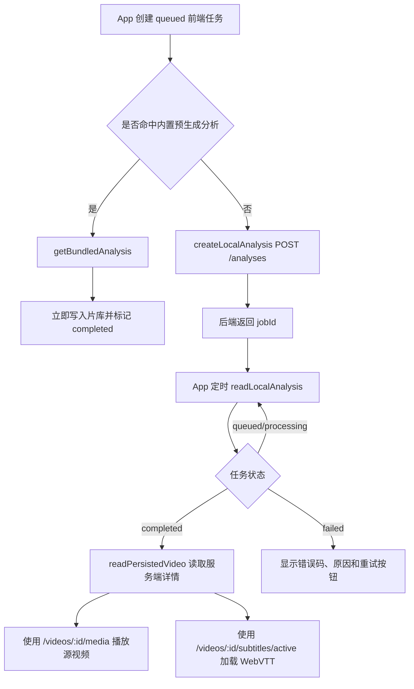
```mermaid
flowchart TD
    A["App 创建 queued 前端任务"] --> B{"是否命中内置预生成分析"}
    B -->|是| C["getBundledAnalysis"]
    C --> D["立即写入片库并标记 completed"]
    B -->|否| E["createLocalAnalysis POST /analyses"]
    E --> F["后端返回 jobId"]
    F --> G["App 定时 readLocalAnalysis"]
    G --> H{"任务状态"}
    H -->|queued/processing| G
    H -->|completed| I["readPersistedVideo 读取服务端详情"]
    I --> K["使用 /videos/:id/media 播放源视频"]
    I --> L["使用 /videos/:id/subtitles/active 加载 WebVTT"]
    H -->|failed| J["显示错误码、原因和重试按钮"]
```

代码出处：`app/src/app/App.tsx`、`app/src/features/analysis-queue/analysisQueue.ts`、
`app/src/features/analysis-queue/AnalysisQueuePanel.tsx`、`app/src/api/analysis.ts`、
`backend/app/controllers/analysis_controller.py`、`backend/app/controllers/library_controller.py`、
`app/src/api/videos.ts`。

### 10.8.1 片库持久化数据底座

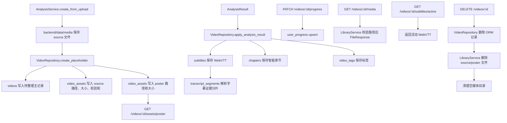
```mermaid
flowchart TD
    A["AnalysisService.create_from_upload"] --> B["backend/data/media 保存 source 文件"]
    B --> C["VideoRepository.create_placeholder"]
    C --> D["videos 写入待整理主记录"]
    C --> E["video_assets 写入 source 路径、大小、校验和"]
    C --> R["video_assets 写入 poster 路径和大小"]
    F["AnalysisResult"] --> G["VideoRepository.apply_analysis_result"]
    G --> H["subtitles 保存 WebVTT"]
    G --> I["chapters 保存智能章节"]
    G --> J["video_tags 保存标签"]
    H --> K["transcript_segments 解析字幕证据分片"]
    L["PATCH /videos/:id/progress"] --> M["user_progress upsert"]
    N["GET /videos/:id/media"] --> O["LibraryService 校验路径后 FileResponse"]
    R --> S["GET /videos/:id/assets/poster"]
    P["GET /videos/:id/subtitles/active"] --> Q["返回活动 WebVTT"]
    T["DELETE /videos/:id"] --> U["VideoRepository 删除 ORM 记录"]
    U --> V["LibraryService 删除 source/poster 文件"]
    V --> W["清理空媒体目录"]
```

代码出处：`backend/app/database/models/video_library.py`、
`backend/app/database/repositories/video_repository.py`、`backend/app/services/library.py`、
`backend/app/controllers/library_controller.py`。

说明：本地导入视频已接入后端持久化。任务完成后，前端会重新读取服务端详情；刷新页面后，
本地导入的视频、源文件、抽帧封面、AI 字幕、章节和观看进度仍可从接口恢复。

### 10.8.2 本地导入视频删除

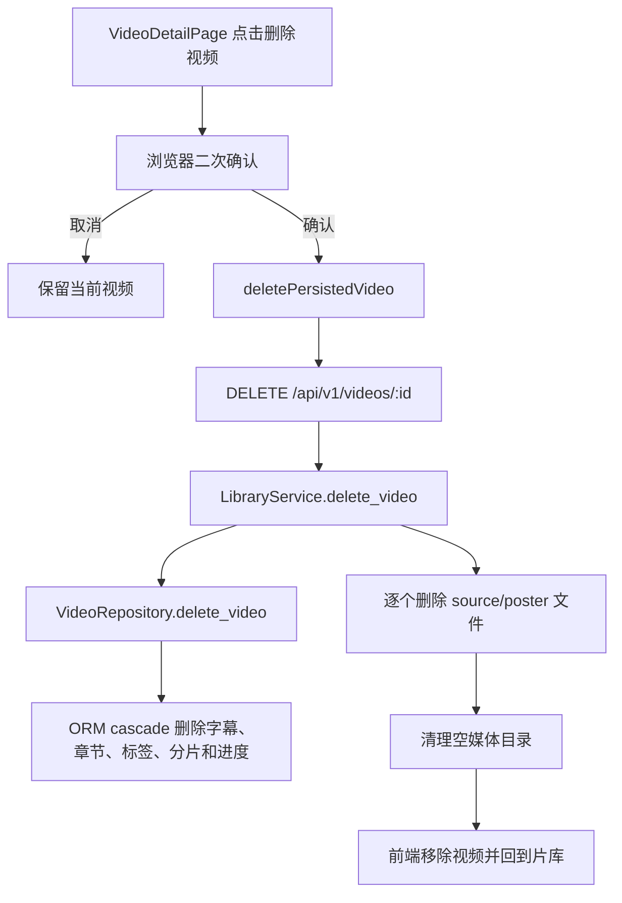
```mermaid
flowchart TD
    A["VideoDetailPage 点击删除视频"] --> B["浏览器二次确认"]
    B -->|取消| C["保留当前视频"]
    B -->|确认| D["deletePersistedVideo"]
    D --> E["DELETE /api/v1/videos/:id"]
    E --> F["LibraryService.delete_video"]
    F --> G["VideoRepository.delete_video"]
    G --> H["ORM cascade 删除字幕、章节、标签、分片和进度"]
    F --> I["逐个删除 source/poster 文件"]
    I --> J["清理空媒体目录"]
    J --> K["前端移除视频并回到片库"]
```

代码出处：`app/src/views/VideoDetailPage.tsx`、`app/src/api/videos.ts`、
`app/src/app/App.tsx`、`backend/app/controllers/library_controller.py`、
`backend/app/services/library.py`、`backend/app/database/repositories/video_repository.py`。

说明：删除入口只对本地导入视频展示，内置演示素材不显示删除按钮。后端删除文件前会把资产
路径解析到 `media_root` 下，防止被污染的数据库路径越界删除其他文件。

### 10.9 后端媒体分析

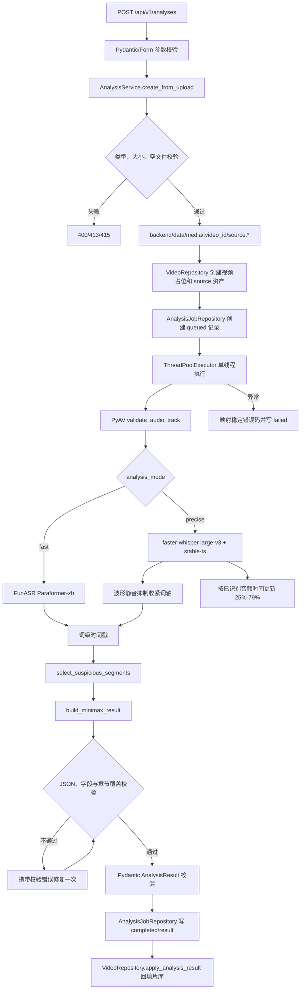
```mermaid
flowchart TD
    A["POST /api/v1/analyses"] --> B["Pydantic/Form 参数校验"]
    B --> C["AnalysisService.create_from_upload"]
    C --> D{"类型、大小、空文件校验"}
    D -->|失败| E["400/413/415"]
    D -->|通过| F["backend/data/media/:video_id/source.*"]
    F --> G["VideoRepository 创建视频占位和 source 资产"]
    G --> H["AnalysisJobRepository 创建 queued 记录"]
    H --> I["ThreadPoolExecutor 单线程执行"]
    I --> J["PyAV validate_audio_track"]
    J --> K{"analysis_mode"}
    K -->|"fast"| L["FunASR Paraformer-zh"]
    K -->|"precise"| M["faster-whisper large-v3 + stable-ts"]
    L --> N["句 / 字符级时间戳"]
    M --> W["波形静音抑制收紧词轴"]
    W --> N["词级时间戳"]
    M --> T["按已识别音频时间更新 25%-79%"]
    N --> O["select_suspicious_segments"]
    O --> P["build_minimax_result"]
    P --> U{"JSON、字段与章节覆盖校验"}
    U -->|"不通过"| V["携带校验错误修复一次"]
    V --> U
    U -->|"通过"| Q["Pydantic AnalysisResult 校验"]
    Q --> R["AnalysisJobRepository 写 completed/result"]
    R --> S["VideoRepository.apply_analysis_result 回填片库"]
    I -->|异常| X["映射稳定错误码并写 failed"]
```

代码出处：`backend/app/controllers/analysis_controller.py`、
`backend/app/services/analysis_jobs.py`、`backend/app/integrations/asr.py`、
`backend/app/services/subtitle_review.py`、`backend/app/integrations/minimax.py`、
`backend/app/database/repositories/analysis_job_repository.py`。

### 10.10 MiniMax 内容整理与字幕检核

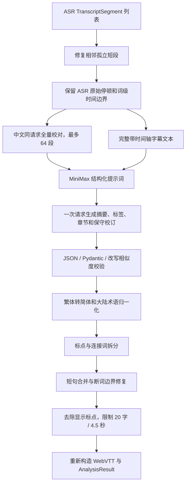
```mermaid
flowchart TD
    A["ASR TranscriptSegment 列表"] --> B["修复相邻孤立短段"]
    B --> C["保留 ASR 原始停顿和词级时间边界"]
    C --> D["中文同请求全量校对，最多 64 段"]
    C --> E["完整带时间轴字幕文本"]
    D --> F["MiniMax 结构化提示词"]
    E --> F
    F --> G["一次请求生成摘要、标签、章节和保守校订"]
    G --> H["JSON / Pydantic / 改写相似度校验"]
    H --> I["繁体转简体和大陆术语归一化"]
    I --> J["标点与连接词拆分"]
    J --> K["短句合并与断词边界修复"]
    K --> L["去除显示标点，限制 20 字 / 4.5 秒"]
    L --> M["重新构造 WebVTT 与 AnalysisResult"]
```

代码出处：`backend/app/services/subtitle_review.py`、
`backend/app/integrations/minimax.py`、`backend/app/services/text_normalization.py`、
`backend/app/services/content_analysis.py`、`backend/app/schemas/__init__.py`。

### 10.11 磁力链接

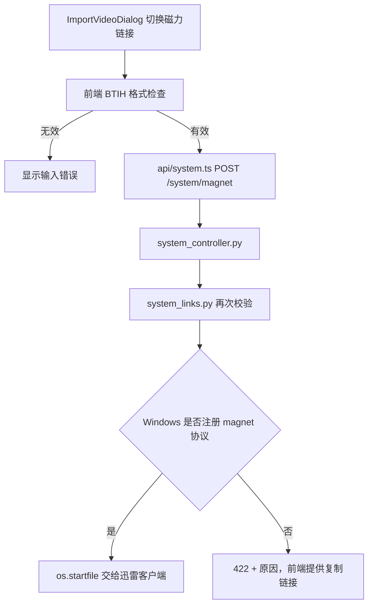
```mermaid
flowchart TD
    A["ImportVideoDialog 切换磁力链接"] --> B["前端 BTIH 格式检查"]
    B -->|无效| C["显示输入错误"]
    B -->|有效| D["api/system.ts POST /system/magnet"]
    D --> E["system_controller.py"]
    E --> F["system_links.py 再次校验"]
    F --> G{"Windows 是否注册 magnet 协议"}
    G -->|是| H["os.startfile 交给迅雷客户端"]
    G -->|否| I["422 + 原因，前端提供复制链接"]
```

代码出处：`app/src/features/import-video/ImportVideoDialog.tsx`、`app/src/api/system.ts`、
`backend/app/controllers/system_controller.py`、`backend/app/integrations/system_links.py`。

说明：该能力只适合后端和浏览器位于同一台 Windows 电脑的本地 Demo。部署到远程 Linux
服务器后，后端无法替用户唤起本机迅雷，这是当前产品化的重要限制。

### 10.12 Demo 本地账号

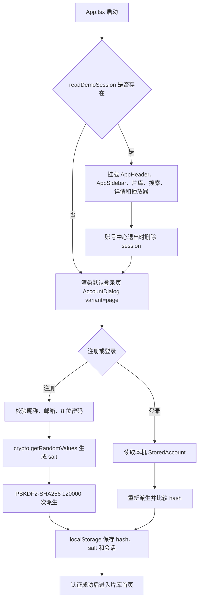
```mermaid
flowchart TD
    A["App.tsx 启动"] --> B{"readDemoSession 是否存在"}
    B -->|否| C["渲染默认登录页 AccountDialog variant=page"]
    C --> D{"注册或登录"}
    D -->|注册| E["校验昵称、邮箱、8 位密码"]
    E --> F["crypto.getRandomValues 生成 salt"]
    F --> G["PBKDF2-SHA256 120000 次派生"]
    G --> H["localStorage 保存 hash、salt 和会话"]
    D -->|登录| I["读取本机 StoredAccount"]
    I --> J["重新派生并比较 hash"]
    J --> H
    H --> K["认证成功后进入片库首页"]
    B -->|是| L["挂载 AppHeader、AppSidebar、片库、搜索、详情和播放器"]
    L --> M["账号中心退出时删除 session"]
    M --> C
```

代码出处：`app/src/features/account/AccountDialog.tsx`、
`app/src/features/account/accountSession.ts`、`app/src/app/App.tsx`。

当前门禁覆盖：

1. 访问 `/` 时没有本地会话会显示登录页，而不是直接进入片库。
2. 访问 `/videos/:id` 或 `/videos/:id/play?t=...` 等深链时，未登录也会先显示登录页。
3. 登录成功统一跳转片库首页，避免评审首次打开深链时直接进入播放器。
4. 退出登录会关闭导入和账号弹窗，并回到登录页。

### 10.13 ASR 离线效果评测

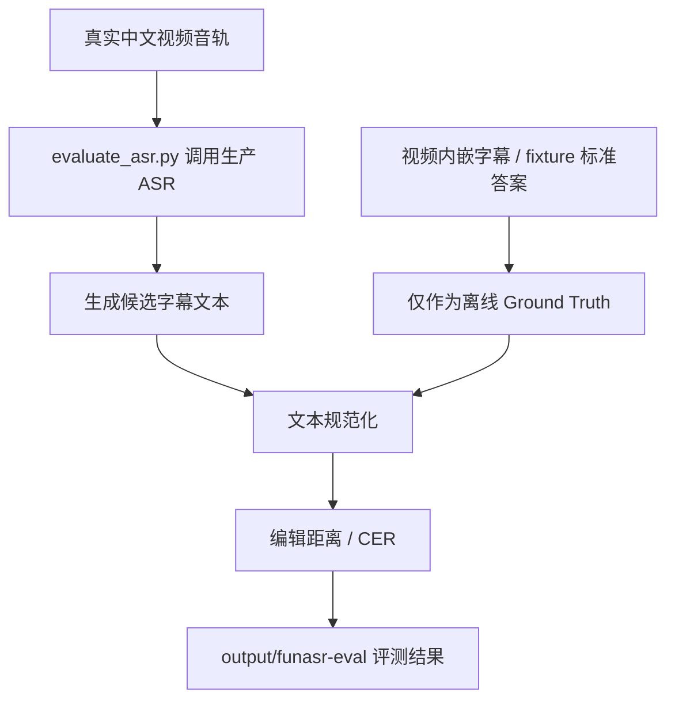
```mermaid
flowchart TD
    A["真实中文视频音轨"] --> B["evaluate_asr.py 调用生产 ASR"]
    B --> C["生成候选字幕文本"]
    D["视频内嵌字幕 / fixture 标准答案"] --> E["仅作为离线 Ground Truth"]
    C --> F["文本规范化"]
    E --> F
    F --> G["编辑距离 / CER"]
    G --> H["output/funasr-eval 评测结果"]
```

代码出处：`backend/tools/evaluate_asr.py`、`backend/tests/fixtures/`、
`backend/app/integrations/asr.py`。OCR 和内嵌字幕不进入线上字幕文本生成链路。

### 10.14 内置样例字幕时间轴校准

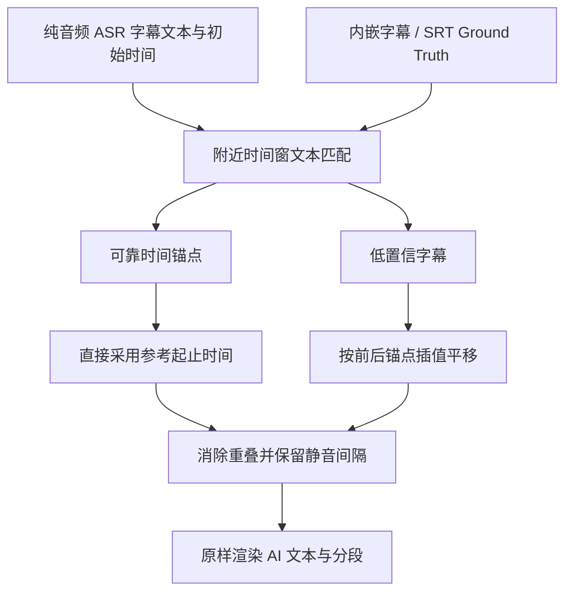
```mermaid
flowchart TD
    A["纯音频 ASR 字幕文本与初始时间"] --> C["附近时间窗文本匹配"]
    B["内嵌字幕 / SRT Ground Truth"] --> C
    C --> D["可靠时间锚点"]
    C --> E["低置信字幕"]
    D --> F["直接采用参考起止时间"]
    E --> G["按前后锚点插值平移"]
    F --> H["消除重叠并保留静音间隔"]
    G --> H
    H --> I["原样渲染 AI 文本与分段"]
```

该流程仅在构建期处理三条内置中文样例。参考字幕不替换 ASR 文本，只提供时间 Ground
Truth。代码出处：`backend/app/services/subtitle_alignment.py`、
`backend/tools/align_vtt_timing.py`、`backend/tests/test_subtitle_timing.py`。

### 10.15 生产请求与部署

```mermaid
flowchart LR
    A["浏览器"] --> B["Nginx :80"]
    B -->|"/assets、视频、VTT"| C["app/dist 静态文件"]
    B -->|"非文件深链接"| D["index.html"]
    D --> E["React History Router"]
    B -->|"/api/*"| F["FastAPI backend:8000"]
    F --> G[("数据库")]
    F --> H["ASR 模型"]
    F --> I["MiniMax API"]
```

代码出处：`deploy/nginx/default.conf`、`app/vite.config.ts`、
`app/src/router/index.ts`、`backend/app/app.py`、`Dockerfile.backend`、`Dockerfile.frontend`、
`docker-compose.yml`、`deploy/README.md`。

说明：当前已具备 Docker Compose 演示底座，数据和媒体写入 `xunlei-data`，模型缓存写入
`xunlei-models`，MiniMax Key 从环境变量注入。公网正式提交前仍需补服务端鉴权、用户隔离、
上传限流、任务取消、HTTPS、监控和备份。

## 11. 关键状态流转

```mermaid
stateDiagram-v2
    [*] --> queued: 上传完成并创建任务
    queued --> processing: 后台线程开始
    processing --> completed: ASR 与内容整理通过校验
    processing --> failed: 媒体、ASR、MiniMax 或结构校验失败
    queued --> failed: 服务重启，旧任务中断
    failed --> queued: 前端用户重试并创建新任务
    completed --> [*]
```

前端将后端 `failed` 映射为可重试的阻塞状态展示；后端重启时不会让旧任务永久停留在
“处理中”，`AnalysisJobRepository.fail_interrupted()` 会把遗留 queued/processing 任务标记失败。

## 12. 配置与密钥

主要配置由 `backend/app/config.py` 从系统环境变量或 `backend/.env.local` 读取：

| 环境变量 | 默认值/作用 |
|---|---|
| `DATABASE_URL` | 默认 `sqlite:///backend/data/xunlei.db` |
| `XUNLEI_MAX_UPLOAD_BYTES` | 默认 300 MB |
| `MINIMAX_API_KEY` | MiniMax 服务密钥，禁止进入前端和 Git |
| `MINIMAX_MODEL` | 默认 `MiniMax-M3` |
| `MINIMAX_BASE_URL` | 默认 `https://api.minimaxi.com` |
| `XUNLEI_PRELOAD_ASR` | 默认 false；设为 true 时在独立守护线程预热快速模型，不占用用户任务执行器 |
| `HF_HUB_DISABLE_XET` | 默认 1；large-v3 使用普通 HTTP 断点续传，避免 Windows 下 Xet 下载无进度 |
| XUNLEI_PRECISE_MODEL_PATH | 预安装 large-v3 目录；默认 backend/models/faster-whisper-large-v3 |

## 13. 本地运行

### 13.1 一键启动

```powershell
cd E:\xunlei
.\tools\start-local-demo.ps1
```

启动后：

- 前端：`http://127.0.0.1:5173/`
- 健康检查：`http://127.0.0.1:8000/api/v1/health`
- OpenAPI：`http://127.0.0.1:8000/api/docs`

### 13.2 分别启动

```powershell
# 后端
cd E:\xunlei\backend
.\run.ps1

# 前端
cd E:\xunlei\app
npm.cmd run dev -- --host 127.0.0.1
```

### 13.3 统一验证

```powershell
cd E:\xunlei
.\tools\verify.ps1
```

验证顺序为：环境预检、Harness 结构、后端测试、前端 Lint、前端单测、生产构建、依赖
审计、桌面与移动 E2E。结果写入 `output/run-receipt.json`，历史记录写入
`output/harness-runs/`。

## 14. 2026-08-08 启动巡检记录

### 14.1 已实际验证的运行结果

| 检查项 | 结果 | 证据 |
|---|---|---|
| FastAPI 健康检查 | 通过 | 返回 `status=ok`、`model=funasr:paraformer-zh`、`device=cpu` |
| OpenAPI 页面 | 通过 | `/api/docs` 返回 HTTP 200 |
| React 首页 | 通过 | 显示 3 个中文、1 个英文已整理真实视频，均无等待任务 |
| 自然语言搜索 | 通过 | “找讲 Python 名字由来的视频”将对应视频排第 1 |
| 章节时间跳转 | 通过 | 点击 `02:04` 后 URL 为 `?t=124`，播放器时间为 124 秒 |
| 字幕 | 通过 | 中文 WebVTT 无重叠、单条不超过 20 字；已修复内置样例按字符均分导致的音轨提前问题 |
| 问视频证据 | 通过 | 返回 `02:04—02:16` 的字幕依据 |
| 无证据拒答 | 通过 | “量子纠缠”问题明确拒答，不用常识补充 |
| 本地导入元数据 | 通过 | 实际读取中文 MP4 的时长、1280×720 分辨率并生成封面 |
| 内置分析复用 | 通过 | 只复用 AI 字段，用户视频与封面继续使用 Blob URL |
| 桌面布局 | 通过 | 1440×900 无页面水平溢出 |
| 移动布局 | 基本通过 | 412×915 无水平溢出；发现触控目标偏小，见下节 |
| 浏览器控制台 | 通过 | 本次核心流程未发现 error/warn |

### 14.2 自动化质量门禁

2026-08-08 执行：

```powershell
powershell.exe -NoProfile -ExecutionPolicy Bypass -File .\tools\verify.ps1
```

| 门禁 | 实测结果 |
|---|---|
| 环境预检 | Node 22.21.0、npm 10.9.4、Git、Chrome、依赖锁文件均通过 |
| Harness | 8 个训练任务、4 个留出任务、5 个必需 Skill，结构通过 |
| 后端测试 | 70/70 通过，包含模式路由、快速模式阶段流转、真实进度、片库 ORM 持久化、媒体/字幕接口、删除接口、后端搜索接口、搜索 Repository/Service、问视频接口、无证据拒答、反馈入库与汇总、MiniMax citation 校验、MiniMax 结构修复、章节覆盖、stable-ts 精准时间轴和字幕校准回归测试 |
| 前端 Lint | 通过 |
| 前端单元测试 | 14/14 通过 |
| 生产构建 | 通过；JS 468.29 kB（gzip 142.17 kB），CSS 66.59 kB（gzip 11.90 kB） |
| npm 依赖审计 | 0 个漏洞 |
| 桌面核心 E2E | 13/13 通过，包含真实导入队列、持久化片库刷新恢复、本地视频删除、精准字幕展示、磁链入口、本地账号和严重可访问性检查 |

本次完整凭证：`output/harness-runs/XL-20260808-fast-asr-queue-stage.json`，状态为
`passed`。本轮已把“精修”从用户界面撤回为后台字幕处理策略，并把快速模式的排队/模型阶段
改为更准确的用户提示：排队时显示“等待整理队列”，快速模型默认后台预热，真正识别时进入
“准备快速识别 / 识别语音”。后端仍会输出已知的 Pydantic magnet 字段告警，不影响测试结果，
修复计划见第 15 节。

最新凭证同时写入 `output/run-receipt.json`。

磁链实际唤起会启动电脑中的外部应用，本次巡检只验证格式、API 和测试覆盖，没有在文档检查
过程中触发外部迅雷客户端。任意新视频的完整 CPU ASR 需要较长时间，本次手工浏览器巡检
使用已验证素材；后端分析分支由自动化测试覆盖。

字幕同步手工抽检覆盖 `eternal-night-survival` 的 `01:58—02:02`：`01:58` 仍显示血量与
攻击力内容，`02:00` 画面内嵌字幕为“三月初”，AI 字幕为“三月初超凡者小队抵达战斗地点”；
未再出现后一句在上一句音轨期间提前显示的问题。

## 15. 当前不足与改进优先级

### P0：提交公网链接前必须处理

1. **前端已有 Demo 门禁，但还没有服务端鉴权与数据隔离。** `App.tsx` 会在没有本地会话时
   拦截片库、搜索、导入和播放器页面，`AccountDialog.tsx` 只使用 localStorage；后端分析接口
   仍无登录校验和用户字段。公网部署后仍必须接入正式身份服务，在数据库增加 user/tenant
   归属，并为上传和查询增加授权、限流和配额。
2. **任务执行器只适合单机 Demo。** `AnalysisService` 使用 `ThreadPoolExecutor(max_workers=1)`；
   多用户会长时间串行等待，进程退出后任务不能恢复。应改为 Redis + Celery/RQ/Dramatiq 等
   独立任务队列，并提供取消、超时、重试次数、预计等待时间和并发控制。
3. **远程部署后磁链唤起逻辑不成立。** `os.startfile(magnet)` 只会打开后端所在 Windows 主机。
   公网 Linux 服务不能唤起用户电脑。应使用受用户手势触发的前端协议链接、桌面助手，或接入
   迅雷内部云盘离线任务 API；当前服务端系统调用只能保留为本地 Demo 能力。
4. **部署底座已有 Compose，但还不是完整生产方案。** 当前已有 Dockerfile、Compose、Nginx
   反代、数据卷、模型缓存卷和环境变量密钥注入；仍缺后端进程守护策略、HTTPS、数据库备份、
   监控告警、灰度发布和对象存储迁移。

### P1：影响核心产品说服力

1. **自然语言搜索已服务化，但仍缺真实向量索引。** `SearchPage.tsx` 会优先调用
   `POST /api/v1/search`，后端通过 `SearchService` 融合标题、文件名、标签、摘要、章节和字幕
   分片得分，并返回 citation；但当前还没有中文 embedding、pgvector、倒排索引持久化和
   rerank。片库扩大后语义泛化仍会受限，建议下一轮复用 FlagEmbedding + pgvector。
2. **“问视频”已接入后端 RAG 雏形，但还缺问答持久化和向量召回。** `PlayerPage.tsx` 优先调用
   `POST /api/v1/videos/{video_id}/questions`，后端只在当前视频章节和字幕分片中检索证据，
   并要求 MiniMax 返回候选 citation；但问答历史、embedding 检索和质量指标尚未落库。
3. **片库持久化已具备单机底座，但还缺生产级生命周期。** 本地导入视频、source/poster 资产、
   AI 字幕、章节、标签、字幕分片和观看进度已落库，也能删除对应记录和文件；下一步需要补
   分页、配额、真实用户隔离、定期巡检孤儿文件和对象存储迁移。
4. **MiniMax 失败会使整个任务失败。** ASR 已完成时仍无法向用户交付字幕。建议保存阶段性产物，
   先提供字幕，再异步重试摘要和章节，使部分成功可见。
5. **精准模式 CPU 推理等待较长。** large-v3 已改为部署前安装并校验，运行期不再下载；队列会按
   已识别的音频时间持续显示进度。`6月13日 (2).mp4` 的实测为 541.955 秒视频转写 997.06 秒，
   CPU 实时因子约 1.84。当前仍没有队列位置、取消和后台通知；服务器应安装 CUDA 12 cuBLAS
   与 cuDNN 9、使用 GPU 量化服务，并在相同 Ground Truth 上记录 CER 与实时因子。

### P2：工程质量与体验优化

1. **缺少数据库迁移。** `Base.metadata.create_all()` 只能建新表，不能安全升级已存在的表。应引入
   Alembic，并把 SQLite 明确限定在本地；多实例使用 PostgreSQL。
2. **前端大文件需要拆分。** `global.css` 约 2456 行，`demoLibrary.ts` 约 504 行，`PlayerPage.tsx`
   约 403 行，`ImportVideoDialog.tsx` 约 372 行。建议按播放器字幕/问答、导入本地/磁链、页面主题
   拆分，降低修改冲突和回归风险。
3. **移动端触控目标偏小。** 实测部分筛选和推荐按钮高度约 31 px，低于常用的 44 px 触控建议。
   应在移动断点提高最小高度和按钮间距，同时保持当前无水平溢出表现。
4. **缺少任务清理策略。** `analysis_jobs` 没有分页、保留期和过期删除；长期运行会累积 JSON 结果。
   应增加按用户分页查询、归档/清理任务和数据库容量监控。
5. **可观测性不足。** 通用异常被转换为友好错误是正确的，但后端没有结构化日志、请求 ID、任务
   耗时、ASR/LLM 指标和告警。生产环境应记录不含原始视频/字幕/密钥的脱敏指标。
6. **中文素材覆盖仍较单一。** 4 个内置视频已调整为 3 个中文、1 个英文，但三条中文均来自同一
   原视频的不同区间。后续应增加不同题材、说话人、口音和噪声场景，并持续记录 CER。
7. **部分 Schema 产生 Pydantic alias 警告。** 自动化测试通过，但 `MagnetOpenRequest`、
   `ProgressUpdate`、`SearchRequest` 和 `FeedbackCreate` 等模型与全局 alias 生成配置组合会输出 alias 元数据
   无效告警。应统一按 Pydantic 推荐写法调整，并增加无警告测试。
8. **前端尚未拆包。** 当前主 JS 为 468.29 kB（gzip 142.17 kB）；Demo 可接受，但接入真实
   检索、图表或更多播放器能力后应按页面动态导入，并单独延迟加载 Plyr。

## 16. 推荐的下一阶段实施顺序

1. 先完成公网部署安全底座：真实鉴权、上传限流、配额、任务取消和密钥管理。
2. 把视频、字幕、章节和进度从 React 内存迁移到 ORM + 对象存储。
3. 将单线程执行器迁移到可恢复任务队列，保存 ASR 阶段性结果。
4. 在现有后端检索接口上补中文 embedding、关键词倒排、pgvector 混合召回和 rerank。
5. 在相同 citation schema 上接入任意问题 RAG，保留无证据拒答。
6. 增加中文多场景评测集，分别衡量 CER、章节覆盖、检索 Recall@K 和回答引用正确率。
7. 补齐容器、HTTPS、监控、备份和可重复发布脚本，再生成公开评审链接。

## 17. ASR API 云端识别补充

### 17.1 功能定位

本轮新增 `analysis_mode=api`，对应火山引擎豆包录音文件识别模型 2.0 标准版。它用于腾讯云小规格服务器上的高质量识别：不加载本地 `Whisper large-v3` 大模型，按音频时长调用云端 ASR，再复用现有 MiniMax-M3 摘要、章节和字幕校核流程。

本地精准模式仍保留给安装包版本。公网演示服务器点击“本地精准”时，前端会提示：服务器配置较小，暂不支持本地 large-v3，可体验快速识别或 ASR API 识别。

### 17.2 代码出处

| 模块 | 代码位置 | 作用 |
|---|---|---|
| 后端模式枚举 | `backend/app/schemas/__init__.py` | `AnalysisMode` 新增 `api` |
| 火山 ASR 适配 | `backend/app/integrations/asr.py` | `VolcAsrTranscriber` 提交任务、轮询结果、解析 utterances/words |
| 临时音频公开读取 | `backend/app/controllers/analysis_controller.py` | `GET /api/v1/analyses/media/{video_id}/asr-audio` 供火山拉取 16k WAV |
| 任务编排 | `backend/app/services/analysis_jobs.py` | `api` 模式进入统一队列，阶段提示为“提交 ASR API” |
| 能力探测 | `backend/app/controllers/health_controller.py` | 返回 `apiAsrReady`，前端据此展示配置状态 |
| 前端导入 | `app/src/features/import-video/ImportVideoDialog.tsx` | 新增 ASR API 识别选项；精准模式不可用时弹出说明 |
| 商业化展示 | `app/src/views/LibraryPage.tsx` | 指标文案从“精准整理权益”改为“高质量识别额度” |

### 17.3 云端 ASR 流程图

```mermaid
flowchart TD
    A["用户上传 MP4/WebM"] --> B["AnalysisService 保存源视频和封面"]
    B --> C{"analysis_mode"}
    C -->|fast| D["FunASR 本地快速识别"]
    C -->|api| E["PyAV 提取 16k 单声道 WAV"]
    E --> F["生成临时公开音频 URL"]
    F --> G["火山 ASR submit"]
    G --> H["火山 ASR query 轮询"]
    H --> I["解析 utterances / words 为 TranscriptSegment"]
    C -->|precise| J["本地 faster-whisper large-v3 + stable-ts"]
    D --> K["MiniMax-M3 摘要、章节、字幕校核"]
    I --> K
    J --> K
    K --> L["ORM 写回视频、字幕、章节、字幕分片"]
```

### 17.4 部署配置

公网 ASR API 模式需要在服务器环境变量中配置：

```env
XUNLEI_BACKEND_DOCKERFILE=Dockerfile.backend.cloud
XUNLEI_PUBLIC_BASE_URL=https://评委可访问的域名或公网IP
VOLC_ASR_API_KEY=
VOLC_ASR_APP_ID=
VOLC_ASR_ACCESS_TOKEN=
VOLC_ASR_RESOURCE_ID=volc.seedasr.auc
VOLC_ASR_BASE_URL=https://openspeech.bytedance.com/api/v3/auc/bigmodel
VOLC_ASR_POLL_INTERVAL_SECONDS=2
VOLC_ASR_TIMEOUT_SECONDS=600
```

新版火山控制台优先使用 `VOLC_ASR_API_KEY`；旧版控制台使用 `VOLC_ASR_APP_ID` + `VOLC_ASR_ACCESS_TOKEN`。真实密钥只允许放在服务器 `.env` 或 `backend/.env.local`，禁止提交到 Git。

腾讯云小规格部署使用 `Dockerfile.backend.cloud`，避免在公网服务器中安装 `torch`、`FunASR`、
`faster-whisper` 和 `stable-ts` 等大模型依赖。该模式下公网 Demo 主推 ASR API 识别，本地
Whisper large-v3 精准模式只在安装包或高配私有部署中开放。云端镜像直接使用基础镜像内置 pip
安装固定依赖，减少服务器额外下载 pip 或系统包导致的构建等待。

### 17.5 商业化表达

产品里将“高质量识别额度”作为会员/按量价值锚点：普通用户可使用快速整理，高价值用户或评委演示可使用 ASR API 获得更稳的中文识别；后续可把云端识别分钟数、任务优先级、批量整理和跨端同步设计为会员权益或按量包。

## 18. 文档维护规则

1. 新增页面时同步更新第 5 节和对应功能流程图。
2. 新增 API 时先定义 Pydantic Schema，再更新第 9 节。
3. 新增数据表必须使用 SQLAlchemy ORM 和 Repository，并更新第 8 节。
4. 更换 ASR、检索、鉴权或任务队列等架构方案时，在 `docs/decisions/` 新增 ADR。
5. 任何“已实现”描述必须能在源码或最新 `output/run-receipt.json` 中找到证据。
6. 预生成 Demo 数据、真实线上能力和未来规划必须使用不同措辞，禁止混淆。
7. 每次修改代码、接口、素材、配置或用户流程，都必须在同一轮变更中同步更新对应中文文档。
